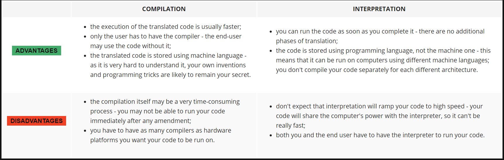

# How does a computer program work?
This course aims to show you what the Python language is and what it is used for. Let's start from the absolute basics.

A program makes a computer usable. Without a program, a computer, even the most powerful one, is nothing more than an object. Similarly, without a player, a piano is nothing more than a wooden box.

Computers are able to perform very complex tasks, but this ability is not innate. A computer's nature is quite different.

It can execute only extremely simple operations, e.g., a computer cannot evaluate the value of a complicated mathematical function by itself, although this isn't beyond the realms of possibility in the near future.

Contemporary computers can only evaluate the results of very fundamental operations, like adding or dividing, but they can do it very fast, and can repeat these actions virtually any number of times.

Imagine that you want to know the average speed you've reached during a long journey. You know the distance, you know the time, you need the speed.

Naturally, the computer will be able to compute this, but the computer is not aware of such things as distance, speed or time. Therefore, it is necessary to instruct the computer to:

  - accept a number representing the distance;
  - accept a number representing the travel time;
  - divide the former value by the latter and store the result in the memory;
  - display the result (representing the average speed) in a readable format.

These four simple actions form a program. Of course, these examples are not formalized, and they are very far from what the computer can understand, but they are good enough to be translated into a language the computer can accept.

`Language` is the keyword.

================================================================================================================================
# Natural languages vs. programming languages
A language is a means (and a tool) for expressing and recording thoughts. There are many languages all around us. Some of them require neither speaking nor writing, such as body language; it's possible to express your deepest feelings very precisely without saying a word.

Another language you use each day is your mother tongue, which you use to manifest your will and to think about reality. Computers have their own language, too, called `machine` language, which is very rudimentary.

A computer, even the most technically sophisticated, is devoid of even a trace of intelligence. You could say that it is like a well-trained dog - it responds only to a predetermined set of known commands.

The commands it recognizes are very simple. We can imagine that the computer responds to orders like "take that number, divide by another and save the result".

A complete set of known commands is called an `instruction list`, sometimes abbreviated to `IL`. Different types of computers may vary depending on the size of their ILs, and the instructions could be completely different in different models.

Note: machine languages are developed by humans.

No computer is currently capable of creating a new language. However, that may change soon. On the other hand, people use a number of very different languages, too, but these languages developed naturally. Moreover, they are still evolving.

New words are created every day and old words disappear. These languages are called `natural languages`.

================================================================================================================================
# What makes a language?
We can say that each language (machine or natural, it doesn't matter) consists of the following elements:

  - an `alphabet`: a set of symbols used to build words of a certain language (e.g., the Latin alphabet for English, the Cyrillic alphabet for Russian, Kanji for Japanese, and so on)
  - a `lexis`: (aka a dictionary) a set of words the language offers its users (e.g., the word "computer" comes from the English language dictionary, while "cmoptrue" doesn't; the word "chat" is present both in English and French dictionaries, but their meanings are different)
  - a `syntax`: a set of rules (formal or informal, written or felt intuitively) used to determine if a certain string of words forms a valid sentence (e.g., "I am a python" is a syntactically correct phrase, while "I a python am" isn't)
  - `semantics`: a set of rules determining if a certain phrase makes sense (e.g., "I ate a doughnut" makes sense, but "A doughnut ate me" doesn't)

The `IL` is, in fact, `the alphabet of a machine language`. This is the simplest and most primary set of symbols we can use to give commands to a computer. It's the computer's mother tongue.

Unfortunately, this tongue is a far cry from a human mother tongue. We all (both computers and humans) need something else, a common language for computers and humans, or a bridge between the two different worlds.

We need a language in which humans can write their programs and a language that computers may use to execute the programs, one that is far more complex than machine language and yet far simpler than natural language.

Such languages are often called high-level programming languages. They are at least somewhat similar to natural ones in that they use symbols, words and conventions readable to humans. These languages enable humans to express commands to computers that are much more complex than those offered by ILs.

A program written in a high-level programming language is called a `source code` (in contrast to the machine code executed by computers). Similarly, the file containing the source code is called the `source file`.

====================================================================================================
# Compilation vs. interpretation
Computer programming is the act of composing the selected programming language's elements in the order that will cause the desired effect. The effect could be different in every specific case - it's up to the programmer's imagination, knowledge and experience.

Of course, such a composition has to be correct in many senses:

  - `alphabetically` - a program needs to be written in a recognizable script, such as Roman, Cyrillic, etc.
  - `lexically` - each programming language has its dictionary and you need to master it; thankfully, it's much simpler and smaller than the dictionary of any natural language;
  - `syntactically` - each language has its rules and they must be obeyed;
  - `semantically` - the program has to make sense.
Unfortunately, a programmer can also make mistakes with each of the above four senses. Each of them can cause the program to become completely useless.

Let's assume that you've successfully written a program. How do we persuade the computer to execute it? You have to render your program into machine language. Luckily, the translation can be done by a computer itself, making the whole process fast and efficient.

There are two different ways of `transforming a program from a high-level programming language into machine language`:

`COMPILATION` - the source program is translated once (however, this act must be repeated each time you modify the source code) by getting a file (e.g., an .exe file if the code is intended to be run under MS Windows) containing the machine code; now you can distribute the file worldwide; the program that performs this translation is called a compiler or translator;

`INTERPRETATION` - you (or any user of the code) can translate the source program each time it has to be run; the program performing this kind of transformation is called an interpreter, as it interprets the code every time it is intended to be executed; it also means that you cannot just distribute the source code as-is, because the end-user also needs the interpreter to execute it.

Due to some very fundamental reasons, a particular high-level programming language is designed to fall into one of these two categories.

There are very few languages that can be both compiled and interpreted. Usually, a programming language is projected with this factor in its constructors' minds - will it be compiled or interpreted?

====================================================================================================
# What does the interpreter actually do?
Let's assume once more that you have written a program. Now, it exists as a `computer file`: a computer program is actually a piece of text, so the source code is usually placed in `text files`.

Note: it has to be `pure text`, without any decorations like different fonts, colors, embedded images or other media. Now you have to invoke the interpreter and let it read your source file.

The interpreter reads the source code in a way that is common in Western culture: from top to bottom and from left to right. There are some exceptions - they'll be covered later in the course.

First of all, the interpreter checks if all subsequent lines are correct (using the four aspects covered earlier).

If the compiler finds an error, it finishes its work immediately. The only result in this case is an `error message`.

The interpreter will inform you where the error is located and what caused it. However, these messages may be misleading, as the interpreter isn't able to follow your exact intentions, and may detect errors at some distance from their real causes.

For example, if you try to use an entity of an unknown name, it will cause an error, but the error will be discovered in the place where it tries to use the entity, not where the new entity's name was introduced.

In other words, the actual reason is usually located a little earlier in the code, e.g., in the place where you had to inform the interpreter that you were going to use the entity of the name.

If the line looks good, the interpreter tries to execute it (note: each line is usually executed separately, so the trio "read-check-execute" can be repeated many times - more times than the actual number of lines in the source file, as some parts of the code may be executed more than once).

It is also possible that a significant part of the code may be executed successfully before the interpreter finds an error. This is normal behavior in this execution model.

You may ask now: which is better? The "compiling" model or the "interpreting" model? There is no obvious answer. If there had been, one of these models would have ceased to exist a long time ago. Both of them have their advantages and their disadvantages.
=========================================================================================================================
# Compilation vs. interpretation - advantages and disadvantages

## What does this all mean for you?
  - Python is an `interpreted language`. This means that it inherits all the described advantages and disadvantages. Of course, it adds some of its unique features to both sets.
  - If you want to program in Python, you'll need the `Python interpreter`. You won't be able to run your code without it. Fortunately, Python is free. This is one of its most important advantages.

Due to historical reasons, languages designed to be utilized in the interpretation manner are often called scripting languages, while the source programs encoded using them are called scripts.

