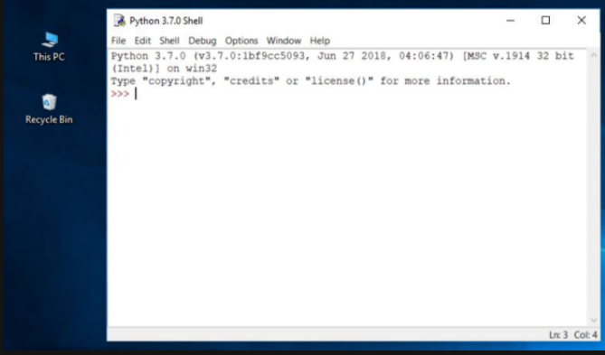
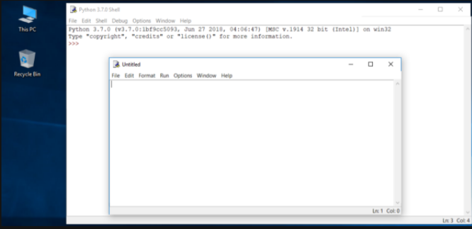
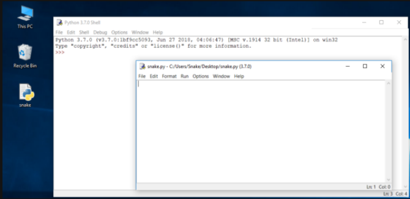
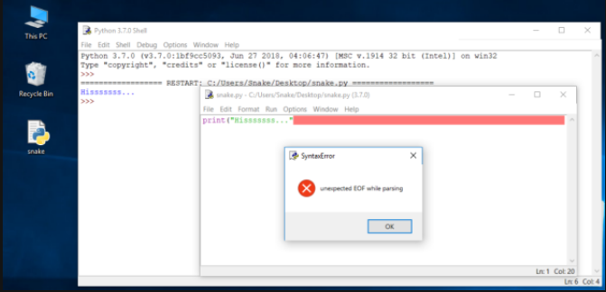
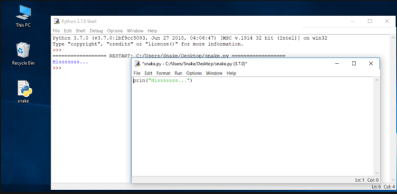
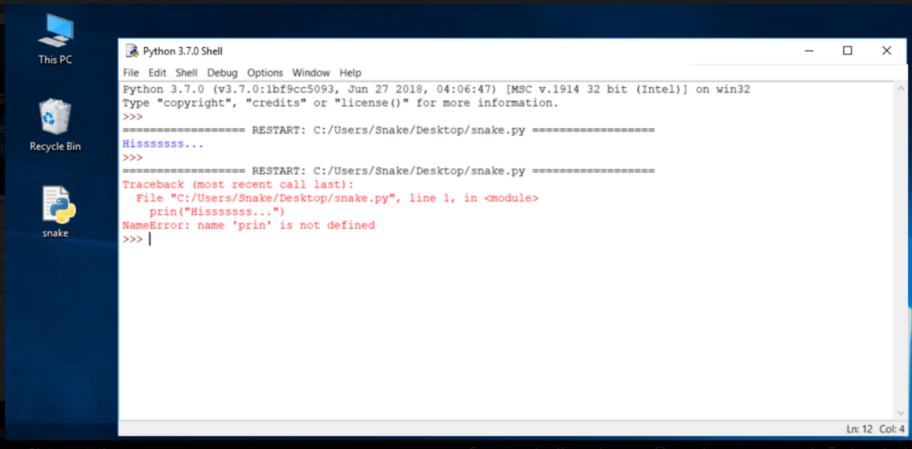

# How to get Python and how to get to use it
There are several ways to get your own copy of Python 3, depending on the operating system you use.

`Linux users most probably have Python already installed` - this is the most likely scenario, as Python's infrastructure is intensively used by many Linux OS components.

For example, some distributors may couple their specific tools together with the system and many of these tools, like package managers, are often written in Python. Some parts of graphical environments available in the Linux world may use Python, too.

If you're a Linux user, open the terminal/console, and type:
```
python3
```
at the shell prompt, press Enter and wait.

If you see something like this:
```
Python 3.4.5 (default, Jan 12 2017, 02:28:40)
[GCC 4.2.1 Compatible Clang 3.7.1 (tags/RELEASE_371/final)] on linux
Type "help", "copyright", "credits" or "license" for more information.
>>>
```

then you don't have to do anything else.
If Python 3 is absent, then refer to your Linux documentation in order to find how to use your package manager to download and install a new package - the one you need is named python3 or its name begins with that.

All non-Linux users can download a copy at https://www.python.org/downloads/.

# Downloading and installing Python
Because the browser tells the site you've entered the OS you use, the only step you have to take is to click the appropriate Python version you want.

In this case, select Python 3. The site always offers you the latest version of it.

If you're a `Windows user`, start the downloaded .exe file and follow all the steps.

Leave the default settings the installer suggests for now, with one exception - look at the checkbox named `Add Python 3.x to PATH` and check it.

This will make things easier.

If you're a `macOS user`, a version of Python 2 may already have been preinstalled on your computer, but since we will be working with Python 3, you will still need to download and install the relevant .pkg file from the Python site.

# Starting your work with Python
Now that you have Python 3 installed, it's time to check if it works and make the very first use of it.

This will be a very simple procedure, but it should be enough to convince you that the Python environment is complete and functional.

There are many ways of utilizing Python, especially if you're going to be a Python developer.

To start your work, you need the following tools:

  - an `editor` which will support you in writing the code (it should have some special features, not available in simple tools); this dedicated editor will give you more than the standard OS equipment;
  - a `console` in which you can launch your newly written code and stop it forcibly when it gets out of control;
  - a tool named a `debugger`, able to launch your code step by step and allowing you to inspect it at each moment of execution.
Besides its many useful components, the Python 3 standard installation contains a very simple but extremely useful application named IDLE.

`IDLE` is an acronym: Integrated Development and Learning Environment.
Navigate through your OS menus, find IDLE somewhere under Python 3.x and launch it. This is what you should see:


# How to write and run your very first program
It is now time to write and run your first Python 3 program. It will be very simple, for now.

The first step is to create a new source file and fill it with code. Click File in the IDLE’s menu and choose New file.

As you can see, IDLE opens a new window for you. You can use it to write and amend your code.

This is the `editor window`. Its only purpose is to be a workplace in which your source code is treated. Do not confuse the editor window with the shell window. They perform different functions.
The editor window is currently untitled, but it's good practice to start work by naming the source file.

Click File (in the new window), then click Save as..., select a folder for the new file (the desktop is a good place for your first programming attempts) and chose a name for the new file.

Note: don't set any extension for the file name you are going to use. Python needs its files to have the .py extension, so you should rely on the dialog window's defaults. Using the standard .py extension enables the OS to properly open these files.

Now put just one line into your newly opened and named editor window.

The line looks like this:
```
print("Hisssssss...")
```
You can use the clipboard to copy the text into the file.

We're not going to explain the meaning of the program right now. You'll find a detailed discussion in the next chapter.

Take a closer look at the quotation marks. These are the simplest form of quotation marks (neutral, straight, dumb, etc.) commonly used in source files. Do not try to use typographic quotes (curved, curly, smart, etc.), used by advanced text processors, as Python doesn’t accept them.
Save the file (File -> Save) and run the program (Run -> Run Module).

If everything goes okay and there are no mistakes in the code, the console window will show you the effects caused by running the program.

In this case, the program hisses.

Try to run it once again. And once more.

Now close both windows now and return to the desktop.


# How to spoil and fix your code
Now start IDLE again.

  - Click File, Open, point to the file you saved previously and let IDLE read it in.
  - Try to run it again by pressing F5 when the editor window is active.
As you can see, IDLE is able to save your code and retrieve it when you need it again.

IDLE contains one additional and helpful feature.
  - First, remove the closing parenthesis.
  - Then enter the parenthesis again.

Your code should look like the one down here:
```output
Hisssssss...
```

Every time you put the closing parenthesis in your program, IDLE will show the part of the text limited with a pair of corresponding parentheses. This helps you to remember to `place them in pairs`.
Remove the closing parenthesis again. The code becomes erroneous. It contains a syntax error now. IDLE should not let you run it.
Try to run the program again. IDLE will remind you to save the modified file. Follow the instructions.

Watch all the windows carefully.

A new window appears – it says that the interpreter has encountered an EOF (end-of-file) although (in its opinion) the code should contain some more text.

The editor window shows clearly where it happened.

Fix the code now. It should look like this:
```
print("Hisssssss...")
```
Run it to see if it "hisses" again.

Let's spoil the code one more time. Remove one letter from the word print. Run the code by pressing F5. As you can see, Python is not able to recognize the error.

You may have noticed that the error message generated for the previous error is quite different from the first one.


This is because the nature of the error is `different` and the error is discovered at a `different stage` of interpretation.

The editor window will not provide any useful information regarding the error, but the console windows might.

The message (in red) shows (in the subsequent lines):

  - the `traceback` (which is the path that the code traverses through different parts of the program - you can ignore it for now, as it is empty in such a simple code);
  - the `location of the error` (the name of the file containing the error, line number and module name); note: the number may be misleading, as Python usually shows the place where it first notices the effects of the error, not necessarily the error itself;
  - the `content of the erroneous line`; note: IDLE’s editor window doesn’t show line numbers, but it displays the current cursor location at the bottom-right corner; use it to locate the erroneous line in a long source code;
  - the `name of the error` and a short explanation.

Experiment with creating new files and running your code. Try to output a different message to the screen, e.g., `roar!`, `meow`, or even maybe an `oink!`. Try to spoil and fix your code - see what happens.
