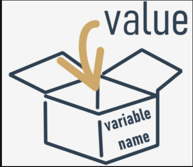
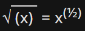
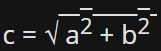

# What are variables?
It seems fairly obvious that Python should allow you to encode literals carrying number and text values.

You already know that you can do some arithmetic operations with these numbers: add, subtract, etc. You'll be doing that many times.

But it's quite a normal question to ask how to `store the results` of these operations, in order to use them in other operations, and so on.

How do you save the intermediate results, and use them again to produce subsequent ones?

Python will help you with that. It offers special "boxes" (containers) for that purpose, and these boxes are called `variables` - the name itself suggests that the content of these containers can be varied in (almost) any way.

What does every Python variable have?

  - a name;
  - a value (the content of the container)

Let's start with the issues related to a variable's name.

Variables do not appear in a program automatically. As developer, you must decide how many and which variables to use in your programs.

You must also name them.

If you want to `give a name to a variable`, you must follow some strict rules:
  - the name of the variable must be composed of upper-case or lower-case letters, digits, and the character `_` (underscore)
  - the name of the variable must begin with a letter;
  - the underscore character is a letter;
  - upper- and lower-case letters are treated as different (a little differently than in the real world - Alice and ALICE are the same first names, but in Python they are two different variable names, and consequently, two different variables);
  - the name of the variable must not be any of Python's reserved words (the keywords - we'll explain more about this soon).

====================================================================================================
# Correct and incorrect variable names
Note that the same restrictions apply to function names.

Python does not impose restrictions on the length of variable names, but that doesn't mean that a long variable name is always better than a short one.

Here are some correct, but not always convenient variable names:

`MyVariable`, `i`, `t34`, `Exchange_Rate`, `counter`, `days_to_christmas`, `TheNameIsSoLongThatYouWillMakeMistakesWithIt`, `_`.

Moreover, Python lets you use not only Latin letters but also characters specific to languages that use other alphabets.

These variable names are also correct:

`Adiós_Señora`, `sûr_la_mer`, `Einbahnstraße`, `переменная`.

And now for some `incorrect names`:

`10t` (does not begin with a letter), `Exchange Rate` (contains a space)


NOTE

The PEP 8 -- Style Guide for Python Code recommends the following naming convention for variables and functions in Python:
  - variable names should be lowercase, with words separated by underscores to improve readability (e.g., var, my_variable)
  - function names follow the same convention as variable names (e.g., fun, my_function)
  - it's also possible to use mixed case (e.g., myVariable), but only in contexts where that's already the prevailing style, to retain backwards compatibility with the adopted convention.

# Keywords
Take a look at the list of words that play a very special role in every Python program.
```
['False', 'None', 'True', 'and', 'as', 'assert', 'break', 'class', 'continue', 'def', 'del', 'elif', 'else', 'except', 'finally', 'for', 'from', 'global', 'if', 'import', 'in', 'is', 'lambda', 'nonlocal', 'not', 'or', 'pass', 'raise', 'return', 'try', 'while', 'with', 'yield']
```

They are called `keywords` or (more precisely) `reserved keywords`. They are reserved because `you mustn't use them as names`: neither for your variables, nor functions, nor any other named entities you want to create.

The meaning of the reserved word is `predefined`, and mustn't be changed in any way.

Fortunately, due to the fact that Python is case-sensitive, you can modify any of these words by changing the case of any letter, thus creating a new word, which is not reserved anymore.

For example - `you can't name` your variable like this:
```
import
```
You mustn't have a variable named in such a way - it is prohibited. But you can do this instead:
```
Import
```
These words might be a mystery to you now, but you'll soon learn the meaning of them.

====================================================================================================
# Creating variables
What can you put inside a variable?

Anything.

You can use a variable to store any value of any of the already presented kinds, and many more of the ones we haven't shown you yet.

The value of a variable is what you have put into it. It can vary as often as you need or want. It can be an integer one moment, and a float a moment later, eventually becoming a string.

Let's talk now about two important things - `how variables are created`, and `how to put values inside them` (or rather - how to give or `pass values` to them).

## REMEMBER
`A variable comes into existence as a result of assigning a value to it`. Unlike in other languages, you don't need to declare it in any special way.

If you assign any value to a nonexistent variable, the variable will be `automatically created`. You don't need to do anything else.

The creation (or otherwise - its syntax) is extremely simple: `just use the name of the desired variable, then the equal sign (=) and the value you want to put into the variable`.

Take a look at the snippet:
```py
var = 1
print(var)
```

It consists of two simple instructions:

  - The first of them creates a variable named var, and assigns a literal with an integer value equal to 1.
  - The second prints the value of the newly created variable to the console.
++++++++++++++++++++++++++++++++++++++++++++++++++++++++++++++++++++++++
Note: `print()` has yet another side to it - it can handle variables too. Q: Do you know what the output of the snippet will be? A: 1
++++++++++++++++++++++++++++++++++++++++++++++++++++++++++++++++++++++++

====================================================================================================
# Using variables
You're allowed to use as many variable declarations as you need to achieve your goal, like this:
```py
var = 1
account_balance = 1000.0
client_name = 'John Doe'
print(var, account_balance, client_name)
print(var)
```

You're `not allowed to use a variable which doesn't exist (in other words, a variable that was not assigned a value).

This example will `cause an error`:
```py
var = 1
print(Var)
```
We've tried to use a variable named `Var`, which doesn't have any value (note: `var` and `Var` are different entities, and have nothing in common as far as Python's concerned).

## REMEMBER

You can use the print() function and combine text and variables using the + operator to output strings and variables, e.g.:
```py
var = "3.8.5"
print("Python version: " + var)
```

Q: Can you guess the output of the snippet above? A: Python version: 3.8.5

====================================================================================================
# Assigning a new value to an already existing variable
How do you assign a new value to an already created variable? In the same way. You just need to use the equal sign.

The equal sign is in fact an assignment operator. Although this may sound strange, the operator has a simple syntax and unambiguous interpretation.

It assigns the value of its right argument to the left, while the right argument may be an arbitrarily complex expression involving literals, operators and already defined variables.

Look at the code below:
```py
var = 1
print(var)
var = var + 1
print(var)
```
The code sends two lines to the console:
```output
1
2
```

The first line of the snippet `creates a new variable` named `var` and assigns `1` to it.
The statement reads: assign a value of `1` to a variable named `var`.

We can say it shorter: assign `1` to `var`.

Some prefer to read such a statement as: `var` becomes `1`.

The third line `assigns the same variable with the new value` taken from the variable itself, summed with `1`. Seeing a record like that, a mathematician would probably protest - no value may be equal to itself plus one. This is a contradiction. But Python treats the sign `=` not as equal to, but as assign a value.

So how do you read such a record in the program?

Take the current value of the variable `var`, add `1` to it and store the result in the variable `var`.

In effect, the value of variable `var` has been `incremented` by one, which has nothing to do with comparing the variable with any value.


Q: Do you know what the output of the following snippet will be?
```py
var = 100
var = 200 + 300
print(var)
```
A: `500` - why? Well, first, the `var` variable is created and assigned a value of 100. Then, the same variable is assigned a new value: the result of adding 200 to 300, which is 500.

====================================================================================================
# Solving simple mathematical problems
Now you should be able to construct a short program solving simple mathematical problems such as the Pythagorean theorem:

The square of the hypotenuse is equal to the sum of the squares of the other two sides.

The following code evaluates the length of the hypotenuse (i.e., the longest side of a right-angled triangle, the one opposite of the right angle) using the Pythagorean theorem:
```py
a = 3.0
b = 4.0
c = (a ** 2 + b ** 2) ** 0.5
print("c =", c)
```

Note: we need to make use of the `**` operator to evaluate the square root as:

and

Q: Can you guess the output of the code?
A: c = 5.0

Check below and run the code in the editor to confirm your predictions.

====================================================================================================
# Shortcut operators
It's time for the next set of operators that make a developer's life easier.

Very often, we want to use one and the same variable both to the right and left sides of the `=` operator.

For example, if we need to calculate a series of successive values of powers of 2, we may use a piece like this:
```
x = x * 2
```
You may use an expression like this if you can't fall asleep and you're trying to deal with it using some good, old-fashioned methods:
```
sheep = sheep + 1
```
Python offers you a shortened way of writing operations like these, which can be coded as follows:
```
x *= 2
sheep += 1
```
Let's try to present a general description for these operations.

If `op` is a two-argument operator (this is a very important condition) and the operator is used in the following context:
```
variable = variable op expression
```
It can be simplified and shown as follows:
```
variable op= expression
```
Take a look at the examples below. Make sure you understand them all.
```
i = i + 2 * j ⇒ i += 2 * j

var = var / 2 ⇒ var /= 2

rem = rem % 10 ⇒ rem %= 10

j = j - (i + var + rem) ⇒ j -= (i + var + rem)

x = x ** 2 ⇒ x **= 2
```

====================================================================================================