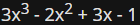

# LAB
Estimated time
10 minutes

# Level of difficulty
Easy

# Objectives
  - becoming familiar with the concept of storing and working with different data types in Python;
  - experimenting with Python code.

# Scenario
Here is a short story:

Once upon a time in Appleland, John had three apples, Mary had five apples, and Adam had six apples. They were all very happy and lived for a long time. End of story.

Your task is to:

  - create the variables: `john`, `mary`, and `adam`;
  - assign values to the variables. The values must be equal to the numbers of fruit possessed by John, Mary, and Adam respectively;
  - having stored the numbers in the variables, print the variables on one line, and separate each of them with a comma;
  - now create a new variable named `total_apples` equal to addition of the three former variables.
  - print the value stored in `total_apples` to the console;
  - `experiment with your code`: create new variables, assign different values to them, and perform various arithmetic operations on them (e.g., +, -, *, /, //, etc.). Try to print a string and an integer together on one line, e.g., `"Total number of apples:"` and `total_apples`.

====================================================================================================
# LAB
# Estimated time
10 minutes

# Level of difficulty
Easy

# Objectives
  - becoming familiar with the concept of, and working with, variables;
  - performing basic computations and conversions;
  - experimenting with Python code.

# Scenario
Miles and kilometers are units of length or distance.

Bearing in mind that `1` mile is equal to approximately `1.61` kilometers, complete the program in the editor so that it converts:

  - miles to kilometers;
  - kilometers to miles.

Do not change anything in the existing code. Write your code in the places indicated by `###`. Test your program with the data we've provided in the source code.


Pay particular attention to what is going on inside the `print()` function. Analyze how we provide multiple arguments to the function, and how we output the expected data.

Note that some of the arguments inside the `print()` function are strings (e.g., `"miles is"`, whereas some other are variables (e.g., `miles`).

## TIP

There's one more interesting thing happening there. Can you see another function inside the `print()` function? It's the `round()` function. Its job is to round the outputted result to the number of decimal places specified in the parentheses, and return a float (inside the `round()` function you can find the variable name, a comma, and the number of decimal places we're aiming for). We're going to talk about functions very soon, so don't worry that everything may not be fully clear yet. We just want to spark your curiosity.


After completing the lab, open Sandbox, and experiment more. Try to write different converters, e.g., a USD to EUR converter, a temperature converter, etc. - let your imagination fly! Try to output the results by combining strings and variables. Try to use and experiment with the `round()` function to round your results to one, two, or three decimal places. Check out what happens if you don't provide any number of digits. Remember to test your programs.

Experiment, draw conclusions, and learn. Be curious.
```py
kilometers = 12.25
miles = 7.38

miles_to_kilometers = ###
kilometers_to_miles = ###

print(miles, "miles is", round(miles_to_kilometers, 2), "kilometers")
print(kilometers, "kilometers is", round(kilometers_to_miles, 2), "miles")
```

Expected output
```output
7.38 miles is 11.88 kilometers
12.25 kilometers is 7.61 miles
```

====================================================================================================
# LAB
# Estimated time
10-15 minutes

# Level of difficulty
Easy

# Objectives
  - becoming familiar with the concept of numbers, operators, and arithmetic operations in Python;
  - performing basic calculations.

# Scenario
Take a look at the code in the editor: it reads a `float` value, puts it into a variable named `x`, and prints the value of a variable named `y`. Your task is to complete the code in order to evaluate the following expression:


The result should be assigned to `y`.

Remember that classical algebraic notation likes to omit the multiplication operator - you need to use it explicitly. Note how we change data type to make sure that `x` is of type `float`.

Keep your code clean and readable, and test it using the data we've provided, each time assigning it to the `x` variable (by hardcoding it). Don't be discouraged by any initial failures. Be persistent and inquisitive.

# Test Data
```py
x =  # hardcode your test data here
x = float(x)
# write your code here
print("y =", y)
```

Sample input
```
x = 0
x = 1
x = -1
```

Expected Output
```output
y = -1.0
y = 3.0
y = -9.0
```