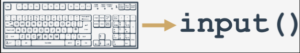

# The input() function
We're now going to introduce you to a completely new function, which seems to be a mirror reflection of the good old `print()` function.

Why? Well, `print()` sends data to the console.

The new function gets data from it.

`print()` has no usable result. The meaning of the new function is to `return a very usable result`.

The function is named `input()`. The name of the function says everything.

The `input()` function is able to read data entered by the user and to return the same data to the running program.

The program can manipulate the data, making the code truly interactive.

Virtually all programs `read and process data`. A program which doesn't get a user's input is a `deaf program`.

Take a look at our example:
```py
print("Tell me anything...")
anything = input()
print("Hmm...", anything, "... Really?")
```
It shows a very simple case of using the `input()` function.

## Note:

  - The program `prompts the user to input some data` from the console (most likely using a keyboard, although it is also possible to input data using voice or image);
  - the `input()` function is invoked without arguments (this is the simplest way of using the function); the function will switch the console to input mode; you'll see a blinking cursor, and you'll be able to input some keystrokes, finishing off by hitting the Enter key; all the inputted data will be sent to your program through the function's result;
  - note: you need to assign the result to a variable; this is crucial - missing out this step will cause the entered data to be lost;
  - then we use the print() function to output the data we get, with some additional remarks.

Try to run the code and let the function show you what it can do for you.


====================================================================================================
# The input() function with an argument
The input() function can do something else: it can prompt the user without any help from print().

We've modified our example a bit, look at the code:
```py
anything = input("Tell me anything...")
print("Hmm...", anything, "...Really?")
```

## Note:

  - the `input()` function is invoked with one argument - it's a string containing a message;
  - the message will be displayed on the console before the user is given an opportunity to enter anything;
  - `input()` will then do its job.

This variant of the `input()` invocation simplifies the code and makes it clearer.

# The result of the input() function
We've said it already, but it must be unambiguously stated once again: the `result of the input() function is a string`.

A string containing all the characters the user enters from the keyboard. It is not an integer or a float.

This means that `you mustn't use it as an argument of any arithmetic operation`, e.g., you can't use this data to square it, divide it by anything, or divide anything by it.
```py
anything = input("Enter a number: ")
something = anything ** 2.0
print(anything, "to the power of 2 is", something)
```

====================================================================================================
# The input() function - prohibited operations
Look at the code in the editor. Run it, enter any number, and press Enter.

What happens?
```py
# Testing TypeError message.

anything = input("Enter a number: ")
something = anything ** 2.0
print(anything, "to the power of 2 is", something)
```
Python should have given you the following output:
```shell
Traceback (most recent call last):
File ".main.py", line 4, in <module>
something = anything ** 2.0
TypeError: unsupported operand type(s) for ** or pow(): 'str' and 'float'
```
The last line of the sentence explains everything - you tried to apply the `**` operator to `'str'` (string) accompanied with `'float'`.

This is prohibited.

This should be obvious - can you predict the value of `"to be or not to be"` raised to the power of `2`?
We can't. Python can't either.
Have we fallen into a deadlock? Is there a solution to this issue? Of course there is.

====================================================================================================
# Type casting
Python offers two simple functions to specify a type of data and solve this problem - here they are: `int()` and `float()`.

Their names are self-commenting:

  - the `int()` function `takes one argument` (e.g., a string: `int(string)`) and tries to convert it into an integer; if it fails, the whole program will fail too (there is a workaround for this situation, but we'll show you this a little later);
  - the `float()` function takes one argument (e.g., a string: `float(string)`) and tries to convert it into a float (the rest is the same).

This is very simple and very effective. Moreover, you can invoke any of the functions by passing the `input()` results directly to them. There's no need to use any variable as an intermediate storage.

We've implemented the idea in the editor - take a look at the code.

Can you imagine how the string entered by the user flows from `input()` into `print()`?

Try to run the modified code. Don't forget to enter a `valid number`.
```py
anything = float(input("Enter a number: "))
something = anything ** 2.0
print(anything, "to the power of 2 is", something)
```
Check some different values, small and big, negative and positive. Zero is a good input, too.

====================================================================================================
# More about input() and type casting
Having a team consisting of the trio `input()`-`int()`-`float()` opens up lots of new possibilities.

You'll eventually be able to write complete programs, accepting data in the form of numbers, processing them and displaying the results.

Of course, these programs will be very primitive and not very usable, as they cannot make decisions, and consequently are not able to react differently to different situations.

This is not really a problem, though; we'll show you how to overcome it soon.

Our next example refers to the earlier program to find the length of a hypotenuse. Let's rewrite it and make it able to read the lengths of the legs from the console.

Check out the editor window - this is how it looks now.

The program asks the user twice for both legs' lengths, evaluates the hypotenuse and prints the result.
```py
leg_a = float(input("Input first leg length: "))
leg_b = float(input("Input second leg length: "))
hypo = (leg_a**2 + leg_b**2) ** .5
print("Hypotenuse length is", hypo)
```
Run it and try to input some negative values.

The program - unfortunately - doesn't react to this obvious error.

Let's ignore this weakness for now. We'll come back to it soon.

Note that in the program that you can see in the editor, the `hypo` variable is used for only one purpose - to save the calculated value between the execution of the adjoining line of code.

As the `print()` function accepts an expression as its argument, you can `remove the variable` from the code.

Just like this:
```py
leg_a = float(input("Input first leg length: "))
leg_b = float(input("Input second leg length: "))
print("Hypotenuse length is", (leg_a**2 + leg_b**2) ** .5)
```

====================================================================================================
# String operators - introduction
It's time to return to these two arithmetic operators: `+` and `*`.

We want to show you that they have a second function. They are able to do something more than just `add` and `multiply`.
We've seen them in action where their arguments are numbers (floats or integers, it doesn't matter).
Now we're going to show you that they can handle strings, too, albeit in a very specific way.


# Concatenation
The `+` (plus) sign, when applied to two strings, becomes a concatenation operator:
```
string + string
```
It simply `concatenates` (glues) two strings into one. Of course, like its arithmetic sibling, it can be used more than once in one expression, and in such a context it behaves according to left-sided binding.

In contrast to its arithmetic sibling, the concatenation operator is `not commutative`, i.e., `"ab" + "ba"` is not the same as `"ba" + "ab"`.

Don't forget - if you want the `+` sign to be a `concatenator`, not an adder, you must ensure that `both its arguments are strings`.

You cannot mix types here.

This simple program shows the `+` sign in its second use:
```py
fnam = input("May I have your first name, please? ")
lnam = input("May I have your last name, please? ")
print("Thank you.")
print("\nYour name is " + fnam + " " + lnam + ".")
```

Note: using `+` to concatenate strings lets you construct the output in a more precise way than with a pure `print()` function, even if enriched with the `end=` and `sep=` keyword arguments.

Run the code and see if the output matches your predictions.

====================================================================================================
# Replication
The `*` (asterisk) sign, when applied to a string and number (or a number and string, as it remains commutative in this position) becomes a `replication operator`:
```
string * number
number * string
```

It replicates the string the same number of times specified by the number.

For example:
```shell
"James" * 3 gives "JamesJamesJames"
3 * "an" gives "ananan"
5 * "2" (or "2" * 5) gives "22222" (not 10!)
```

## REMEMBER

A number less than or equal to zero produces an `empty string`.
This simple program "draws" a rectangle, making use of an old operator (+) in a new role:
```py
print("+" + 10 * "-" + "+")
print(("|" + " " * 10 + "|\n") * 5, end="")
print("+" + 10 * "-" + "+")
```

Note the way in which we've used the parentheses in the second line of the code.
Try practicing to create other shapes or your own artwork!

====================================================================================================
# Type conversion: str()
You already know how to use the `int()` and `float()` functions to convert a string into a number.

This type of conversion is not a one-way street. You can also `convert a number into a string`, which is way easier and safer - this operation is always possible.

A function capable of doing that is called `str()`:
```py
str(number)
```

To be honest, it can do much more than just transform numbers into strings, but that can wait for later.

# The "right-angle triangle" again
Here is our "right-angle triangle" program again:
```py
leg_a = float(input("Input first leg length: "))
leg_b = float(input("Input second leg length: "))
print("Hypotenuse length is " + str((leg_a**2 + leg_b**2) ** .5))
```

We've modified it a bit to show you how the `str()` function works. Thanks to this, we can `pass the whole result to the print() function as one string`, forgetting about the commas.


You've made some serious strides on your way to Python programming.

You already know the basic data types, and a set of fundamental operators. You know how to organize the output and how to get data from the user. These are very strong foundations for Module 3. But before we move on to the next module, let's do a few labs, and recap all that you've learned in this section.

====================================================================================================