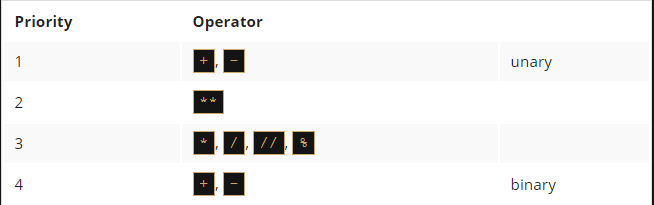

# Python as a calculator
Now, we're going to show you a completely new side of the print() function. You already know that the function is able to show you the values of the literals passed to it by arguments.

In fact, it can do something more. Take a look at the snippet:
```py
print(2+2)
```

Retype the code in the editor and run it. Can you guess the output?

You should see the number four. Feel free to experiment with other operators.

Without taking this too seriously, you've just discovered that Python can be used as a calculator. Not a very handy one, and definitely not a pocket one, but a calculator nonetheless.

Taking it more seriously, we are now entering the province of `operators` and `expressions`.


# Basic operators
An `operator` is a symbol of the programming language, which is able to operate on the values.

For example, just as in arithmetic, the `+` (plus) sign is the operator which is able to `add` two numbers, giving the result of the addition.

Not all Python operators are as obvious as the plus sign, though, so let's go through some of the operators available in Python, and we'll explain which rules govern their use, and how to interpret the operations they perform.

We'll begin with the operators which are associated with the most widely recognizable arithmetic operations:
`                                        +, -, *, /, //, %, **                 `
The order of their appearance is not accidental. We'll talk more about it once we've gone through them all.

`Remember`: Data and operators when connected together form `expressions`. The simplest expression is a literal itself.

====================================================================================================
# Arithmetic operators: exponentiation
A `**` (double asterisk) sign is an `exponentiation` (power) operator. Its left argument is the `base`, its right, the `exponent`.

Classical mathematics prefers notation with superscripts, just like this: 2^3. Pure text editors don't accept that, so Python uses `**` instead, e.g., `2 ** 3`.

Take a look at our examples in the editor window.

Note: we've surrounded the double asterisks with spaces in our examples. It's not compulsory, but it improves the `readability` of the code.

The examples show a very important feature of virtually all Python `numerical operators`.

Run the code and look carefully at the results it produces. Can you see any regularity here?

`Remember`: It's possible to formulate the following rules based on this result:

  - when `both **` arguments are integers, the result is an integer, too;
  - when `at least one **` argument is a float, the result is a float, too.

This is an important distinction to remember.
```py
print(2 ** 3)
print(2 ** 3.)
print(2. ** 3)
print(2. ** 3.)
```

====================================================================================================
# Arithmetic operators: multiplication
An `*` (asterisk) sign is a `multiplication` operator.

Run the code below and check if our integer vs. float rule is still working.
```py
print(2 * 3)
print(2 * 3.)
print(2. * 3)
print(2. * 3.)
```

# Arithmetic operators: division
A `/` (slash) sign is a `divisional` operator.

The value in front of the slash is a `dividend`, the value behind the slash, a `divisor`.

Run the code below and analyze the results.
```py
print(6 / 3)
print(6 / 3.)
print(6. / 3)
print(6. / 3.)
```

You should see that there is an exception to the rule.

`The result produced by the division operator is always a float`, regardless of whether or not the result seems to be a float at first glance: `1 / 2`, or if it looks like a pure integer: `2 / 1`.

Is this a problem? Yes, it is. It happens sometimes that you really need a division that provides an integer value, not a float.

Fortunately, Python can help you with that.

====================================================================================================
# Arithmetic operators: integer division
A `//` (double slash) sign is an `integer divisional` operator. It differs from the standard `/` operator in two details:

  - its result lacks the fractional part - it's absent (for integers), or is always equal to zero (for floats); this means that the results are always rounded;
  - it conforms to the integer vs. float rule.

Run the example below and see the results:
```py
print(6 // 3)
print(6 // 3.)
print(6. // 3)
print(6. // 3.)
```
As you can see, integer by integer division gives an integer result. All other cases produce floats.

Let's do some more advanced tests.

Look at the following snippet:
```py
print(6 // 4)
print(6. // 4)
```

Imagine that we used `/` instead of `//` - could you predict the results?

Yes, it would be `1.5` in both cases. That's clear.

But what results should we expect with `//` division?

Run the code and see for yourself.


What we get is two ones - one integer and one float.

The result of integer division is always rounded to the nearest integer value that is less than the real (not rounded) result.

This is very important: `rounding always goes to the lesser integer`.

Look at the code below and try to predict the results once again:
```py
print(-6 // 4)
print(6. // -4)
```
++++++++++++++++++++++++++++++++++++++++++++++++++++++++++++++++
Note: some of the values are negative. This will obviously affect the result. But how?
++++++++++++++++++++++++++++++++++++++++++++++++++++++++++++++++

The result is two negative twos. The real (not rounded) result is `-1.5` in both cases. However, the results are the subjects of rounding. The `rounding goes toward the lesser integer value`, and the lesser integer value is `-2`, hence: `-2` and `-2.0`.

++++++++++++++++++++++++++++++++++++++++++++++++++++++++++++++++
NOTE: Integer division can also be called floor division. You will definitely come across this term in the future.
++++++++++++++++++++++++++++++++++++++++++++++++++++++++++++++++
====================================================================================================
# Operators: remainder (modulo)
The next operator is quite a peculiar one, because it has no equivalent among traditional arithmetic operators.

Its graphical representation in Python is the `%` (percent) sign, which may look a bit confusing.

Try to think of it as of a slash (division operator) accompanied by two funny little circles.

The result of the operator is a `remainder left after the integer division`.

In other words, it's the value left over after dividing one value by another to produce an integer quotient.

Note: the operator is sometimes called `modulo` in other programming languages.

Take a look at the snippet - try to predict its result and then run it:
```py
print(14 % 4)
```

As you can see, the result is two. This is why:

  - `14 // 4` gives 3 → this is the integer quotient;
  - `3 * 4` gives 12 → as a result of quotient and divisor multiplication;
  - `14 - 12` gives 2 → this is the remainder.

This example is somewhat more complicated:
```py
print(12 % 4.5)
```

What is the result?
Answer ->` 3.0 - not 3 but 3.0 (the rule still works: 12 // 4.5 gives 2.0; 2.0 * 4.5 gives 9.0; 12 - 9.0 gives 3.0) `

# Operators: how not to divide
As you probably know, division by zero doesn't work.

Do `not` try to:

  - perform a division by zero;
  - perform an integer division by zero;
  - find a remainder of a division by zero.

====================================================================================================
# Operators: addition
The `addition` operator is the `+` (plus) sign, which is fully in line with mathematical standards.

Again, take a look at the snippet of the program below:
```py
print(-4 + 4)
print(-4. + 8)
```

The result should be nothing surprising. Run the code to check it.

# The subtraction operator, unary and binary operators
The `subtraction` operator is obviously the `-` (minus) sign, although you should note that this operator also has another meaning - `it can change the sign of a number`.

This is a great opportunity to present a very important distinction between unary and binary operators.

In subtracting applications, the `minus operator expects two arguments`: the left (a `minuend` in arithmetical terms) and right (a `subtrahend`).

For this reason, the subtraction operator is considered to be one of the binary operators, just like the addition, multiplication and division operators.

But the minus operator may be used in a different (unary) way - take a look at the last line of the snippet below:
```py
print(-4 - 4)
print(4. - 8)
print(-1.1)
```

By the way: there is also a unary `+` operator. You can use it like this:
```py
print(+2)
```

The operator preserves the sign of its only argument - the right one.

Although such a construction is syntactically correct, using it doesn't make much sense, and it would be hard to find a good rationale for doing so.

Take a look at the snippet above - can you guess its output?

====================================================================================================
# Operators and their priorities
So far, we've treated each operator as if it had no connection with the others. Obviously, such an ideal and simple situation is a rarity in real programming.

Also, you will very often find more than one operator in one expression, and then this presumption is no longer so obvious.

Consider the following expression:
```
2 + 3 * 5
```
You probably remember from school that `multiplications precede additions`.

You surely remember that you should first multiply 3 by 5 and, keeping the 15 in your memory, then add it to 2, thus getting the result of 17.

The phenomenon that causes some operators to act before others is known as `the hierarchy of priorities`.

Python precisely defines the priorities of all operators, and assumes that operators of a larger (higher) priority perform their operations before the operators of a lower priority.

So, if you know that `*` has a higher priority than `+`, the computation of the final result should be obvious.

# Operators and their bindings
The `binding` of the operator determines the order of computations performed by some operators with equal priority, put side by side in one expression.

Most of Python's operators have left-sided binding, which means that the calculation of the expression is conducted from left to right.

This simple example will show you how it works. Take a look:
```py
print(9 % 6 % 2)
```

There are two possible ways of evaluating this expression:

  - from left to right: first `9 % 6` gives `3`, and then `3 % 2` gives `1`;
  - from right to left: first `6 % 2` gives `0`, and then `9 % 0` causes `a fatal error`.

Run the example and see what you get.

The result should be `1`. This operator has `left-sided binding`. But there's one interesting exception.

====================================================================================================
# Operators and their bindings: exponentiation
Repeat the experiment, but now with exponentiation.

Use this snippet of code:
```py
print(2 ** 2 ** 3)
```

The two possible results are:

  - 2 ** 2 → 4; 4 ** 3 → 64
  - 2 ** 3 → 8; 2 ** 8 → 256

Run the code. What do you see?

The result clearly shows that `the exponentiation operator uses right-sided binding.`

====================================================================================================
# List of priorities
Since you're new to Python operators, we don't want to present the complete list of operator priorities right now.
Instead, we'll show you its truncated form, and we'll expand it consistently as we introduce new operators.

Look at the table below:

++++++++++++++++++++++++++++++++++++++++++++++++++++++++++++++++
Note: we've enumerated the operators in order from the highest (1) to the lowest (4) priorities.
++++++++++++++++++++++++++++++++++++++++++++++++++++++++++++++++

Try to work through the following expression:
```py
print(2 * 3 % 5)
```
Q: Both operators (* and %) have the same priority, so the result can be guessed only when you know the binding direction. How do you think? What is the result? A: `1`

# Operators and parentheses
Of course, you're always allowed to use `parentheses`, which can change the natural order of a calculation.

In accordance with the arithmetic rules, `subexpressions in parentheses are always calculated first`.

You can use as many parentheses as you need, and they're often used to `improve the readability` of an expression, even if they don't change the order of the operations.

An example of an expression with multiple parentheses is here:
```py
print((5 * ((25 % 13) + 100) / (2 * 13)) // 2)
```
Q: Try to compute the value that's printed to the console. What's the result of the `print()` function? A: `10.0`
