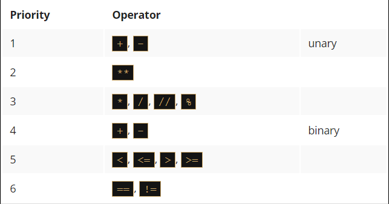

# Questions and answers
A programmer writes a program and `the program asks questions`.

A computer executes the program and `provides the answers`. The program must be able to `react according to the received answers`.

Fortunately, computers know only two kinds of answers:

  - yes, this is true;
  - no, this is false.

You will never get a response like Let me think...., I don't know, or Probably yes, but I don't know for sure.

`To ask questions, Python uses a set of very special operators`. Let's go through them one after another, illustrating their effects on some simple examples.


# Comparison: equality operator
Question: `are two values equal?`

To ask this question, you use the `==` (equal equal) operator.

Don't forget this important distinction:

  - `=` is an `assignment operator`, e.g., `a = b` assigns `a` with the value of `b`;
  - `==` is the question are these values equal?; `a == b` compares `a` and `b`.

It is a `binary operator with left-sided binding`. It needs two arguments and `checks if they are equal`.

# Exercises
Now let's ask a few questions. Try to guess the answers.

Question #1: What is the result of the following comparison?
    `2 == 2` 
    Answer #1: yes, this is `True`;
        True - of course, 2 is equal to 2. Python will answer True (remember this pair of predefined literals, 
        True and False - they're Python keywords, too).

Question #2: What is the result of the following comparison?
    `2 == 2.`
    Answer #1: yes, this is `True`;
    This question is not as easy as the first one. Luckily, Python is able to convert the integer value into its real equivalent, and consequently, the answer is True.

Question #3: What is the result of the following comparison?
    `1 == 2`
    Answer #1: `no, this is false`
    This should be easy. The answer will be (or rather, always is) False

====================================================================================================
# Equality: the equal to operator (==)

The `==` (equal to) operator compares the values of two operands. If they are equal, the result of the comparison is `True`. If they are not equal, the result of the comparison is `False`.

Look at the equality comparison below - what is the result of this operation?
```py
var == 0
```

Note that we cannot find the answer if we do not know what value is currently stored in the variable `var`.

If the variable has been changed many times during the execution of your program, or its initial value is entered from the console, the answer to this question can be given only by Python and only at runtime.

Now imagine a programmer who suffers from insomnia, and has to count black and white sheep separately as long as there are exactly twice as many black sheep as white ones.

The question will be as follows:
```py
black_sheep == 2 * white_sheep 
```

Due to the low priority of the == operator, the question shall be treated as equivalent to this one:
```py
black_sheep == (2 * white_sheep)
```

So, let's practice your understanding of the == operator now - can you guess the output of the code below?
```py
var = 0  # Assigning 0 to var
print(var == 0)

var = 1  # Assigning 1 to var
print(var == 0)
```

Run the code and check if you were right.

# Inequality: the not equal to operator (!=)
The `!=` (not equal to) operator compares the values of two operands, too. Here is the difference: if they are equal, the result of the comparison is `False`. If they are not equal, the result of the comparison is `True`.

Now take a look at the inequality comparison below - can you guess the result of this operation?
```py
var = 0  # Assigning 0 to var
print(var != 0)

var = 1  # Assigning 1 to var
print(var != 0)
```

Run the code and check if you were right.

====================================================================================================
# Comparison operators: greater than
You can also ask a comparison question using the `>` (greater than) operator.

If you want to know if there are more black sheep than white ones, you can write it as follows:
```py
black_sheep > white_sheep  # Greater than
```

True confirms it; False denies it.

# Comparison operators: greater than or equal to
The greater than operator has another special, `non-strict` variant, but it's denoted differently than in classical arithmetic notation: `>=` (greater than or equal to).

There are two subsequent signs, not one.

Both of these operators (strict and non-strict), as well as the two others discussed in the next section, are `binary operators with left-sided binding`, and their `priority is greater than that shown` by `==` and `!=`.

If we want to find out whether or not we have to wear a warm hat, we ask the following question:

centigrade_outside ≥ 0.0  # Greater than or equal to

# Comparison operators: less than or equal to
As you've probably already guessed, the operators used in this case are: the `<` (less than) operator and its non-strict sibling: `<=` (less than or equal to).

Look at this simple example:
```py
current_velocity_mph < 85  # Less than
current_velocity_mph ≤ 85  # Less than or equal to
```

We're going to check if there's a risk of being fined by the highway police (the first question is strict, the second isn't).

# Making use of the answers
What can you do with the answer (i.e., the result of a comparison operation) you get from the computer?

There are at least two possibilities: first, you can memorize it (`store it in a variable`) and make use of it later. How do you do that? Well, you would use an arbitrary variable like this:
```py
answer = number_of_lions >= number_of_lionesses
```

The content of the variable will tell you the answer to the question asked.

The second possibility is more convenient and far more common: you can use the answer you get to `make a decision about the future of the program`.

You need a special instruction for this purpose, and we'll discuss it very soon.

Now we need to update our `priority table`, and put all the new operators into it. It now looks as follows:
