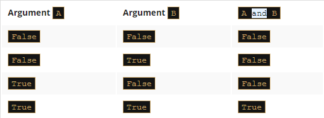
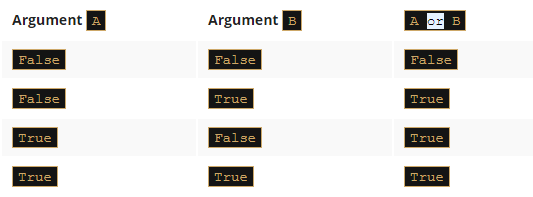
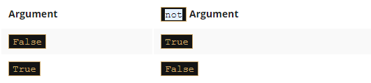
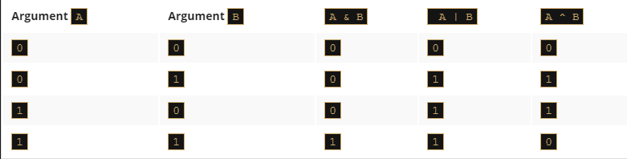
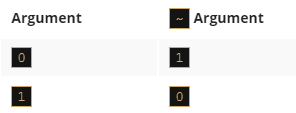
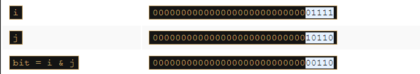
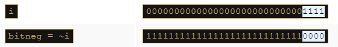
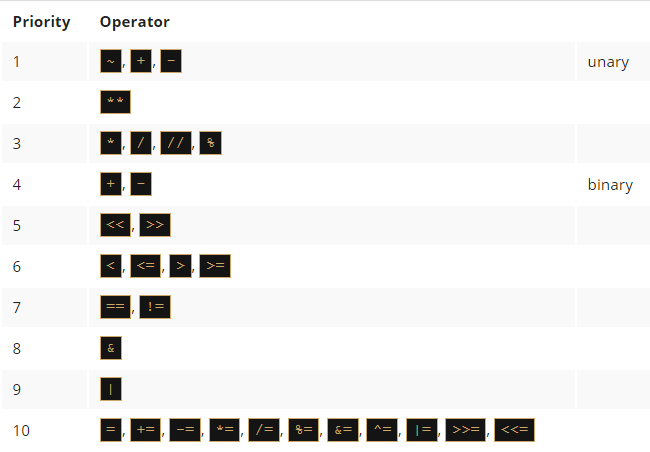

# Computer logic
Have you noticed that the conditions we've used so far have been very simple, not to say, quite primitive? The conditions we use in real life are much more complex. Let's look at this sentence:

If we have some free time, and the weather is good, we will go for a walk.


We've used the conjunction `and`, which means that going for a walk depends on the simultaneous fulfilment of these two conditions. In the language of logic, such a connection of conditions is called a `conjunction`. And now another example:

If you are in the mall or I am in the mall, one of us will buy a gift for Mom.


The appearance of the word `or` means that the purchase depends on at least one of these conditions. In logic, such a compound is called a `disjunction`.

It's clear that Python must have operators to build conjunctions and disjunctions. Without them, the expressive power of the language would be substantially weakened. They're called `logical operators`.

## and
One logical conjunction operator in Python is the word and. It's a binary operator with a priority that is lower than the one expressed by the comparison operators. It allows us to code complex conditions without the use of parentheses like this one:
```py
counter > 0 and value == 100
```

The result provided by the `and` operator can be determined on the basis of the `truth table`.

If we consider the conjunction of `A` and `B`, the set of possible values of arguments and corresponding values of the conjunction looks as follows:


## or
A disjunction operator is the word `or`. It's a `binary operator with a lower priority than and` (just like `+` compared to `*`). Its truth table is as follows:


## not
In addition, there's another operator that can be applied for constructing conditions. It's a `unary operator performing a logical negation`. Its operation is simple: it turns truth into falsehood and falsehood into truth.

This operator is written as the word `not`, and its `priority is very high: the same as the unary + and -`. Its truth table is simple:


==============================================================================================
# Logical expressions
Let's create a variable named `var` and assign `1` to it. The following conditions are pairwise `equivalent`:
```py
# Example 1:
print(var > 0)
print(not (var <= 0))


# Example 2:
print(var != 0)
print(not (var == 0))
```

You may be familiar with De Morgan's laws. They say that:

The negation of a conjunction is the disjunction of the negations.

The negation of a disjunction is the conjunction of the negations.


Let's write the same thing using Python:
```py
not (p and q) == (not p) or (not q)
not (p or q) == (not p) and (not q)
```

Note how the parentheses have been used to code the expressions - we put them there to improve readability.

We should add that none of these two-argument operators can be used in the abbreviated form known as `op=`. This exception is worth remembering.

# Logical values vs. single bits
Logical operators take their arguments as a whole regardless of how many bits they contain. The operators are aware only of the value: zero (when all the bits are reset) means `False`; not zero (when at least one bit is set) means `True`.

The result of their operations is one of these values: `False` or `True`. This means that this snippet will assign the value `True` to the `j` variable if `i` is not zero; otherwise, it will be `False`.
```py
i = 1
j = not not i
```

# Bitwise operators
However, there are four operators that allow you to manipulate single bits of data. They are called bitwise operators.

They cover all the operations we mentioned before in the logical context, and one additional operator. This is the `xor` (as in `exclusive or`) operator, and is denoted as `^` (caret).

Here are all of them:

  - `&` (ampersand) - bitwise conjunction;
  - `|` (bar) - bitwise disjunction;
  - `~` (tilde) - bitwise negation;
  - `^` (caret) - bitwise exclusive or (xor).

Bitwise operations (&, |, and ^)



Let's make it easier:

  - `&` requires exactly two `1`s to provide `1` as the result;
  - `|` requires at least one `1` to provide `1` as the result;
  - `^` requires exactly one `1` to provide `1` as the result.

Let us add an important remark: the arguments of these operators `must be integers`; we must not use floats here.

The difference in the operation of the logical and bit operators is important: `the logical operators do not penetrate into the bit level of its argument`. They're only interested in the final integer value.

Bitwise operators are stricter: they deal with `every bit separately`. If we assume that the integer variable occupies 64 bits (which is common in modern computer systems), you can imagine the bitwise operation as a 64-fold evaluation of the logical operator for each pair of bits of the arguments. This analogy is obviously imperfect, as in the real world all these 64 operations are performed at the same time (simultaneously).

==============================================================================================
# Logical vs. bit operations: continued
We'll now show you an example of the difference in operation between the logical and bit operations. Let's assume that the following assignments have been performed:
```py
i = 15
j = 22
```

If we assume that the integers are stored with 32 bits, the bitwise image of the two variables will be as follows:
```py
i: 00000000000000000000000000001111
j: 00000000000000000000000000010110
```
The assignment is given:
```py
log = i and j
```

We are dealing with a logical conjunction here. Let's trace the course of the calculations. Both variables `i` and `j` are not zeros, so will be deemed to represent `True`. Consulting the truth table for the `and` operator, we can see that the result will be `True`. No other operations are performed.
```py
log: True
```

Now the bitwise operation - here it is:
```py
bit = i & j
```

The `&` operator will operate with each pair of corresponding bits separately, producing the values of the relevant bits of the result. Therefore, the result will be as follows:

These bits correspond to the integer value of six.

Let's look at the negation operators now. First the logical one:
```py
logneg = not i
```

The `logneg` variable will be set to `False` - nothing more needs to be done.

The bitwise negation goes like this:
```py
bitneg = ~i
```

It may be a bit surprising: the `bitneg` variable value is `-16`. This may seem strange, but isn't at all. If you wish to learn more, you should check out the binary numeral system and the rules governing two's complement numbers.


Each of these two-argument operators can be used in `abbreviated form`. These are the examples of their equivalent notations:


==============================================================================================
# How do we deal with single bits?
We'll now show you what you can use bitwise operators for. Imagine that you're a developer obliged to write an important piece of an operating system. You've been told that you're allowed to use a variable assigned in the following way:
```py
flag_register = 0x1234
```

The variable stores the information about various aspects of system operation. `Each bit of the variable stores one yes/no value`. You've also been told that only one of these bits is yours - the third (remember that bits are numbered from zero, and bit number zero is the lowest one, while the highest is number 31). The remaining bits are not allowed to change, because they're intended to store other data. Here's your bit marked with the letter `x`:
```py
flag_register = 0000000000000000000000000000x000
```

You may be faced with the following tasks:

1. `Check the state of your bit` - you want to find out the value of your bit; comparing the whole variable to zero will not do anything, because the remaining bits can have completely unpredictable values, but you can use the following conjunction property:
```py
x & 1 = x
x & 0 = 0
```

If you apply the `&` operation to the `flag_register` variable along with the following bit image:
```py
00000000000000000000000000001000
```
(note the `1` at your bit's position) as the result, you obtain one of the following bit strings:

  - `00000000000000000000000000001000` if your bit was set to `1`
  - `0000000000000000000000000000000` if your bit was reset to `0`

Such a sequence of zeros and ones, whose task is to grab the value or to change the selected bits, is called a `bit mask`.

Let's build a bit mask to detect the state of your bit. It should point to `the third bit`. That bit has the weight of `2**3 = 8`. A suitable mask could be created by the following declaration:
```py
the_mask = 8
```

You can also make a sequence of instructions depending on the state of your bit i here it is:
```py
if flag_register & the_mask:
    # My bit is set.
else:
    # My bit is reset.
```

2. `Reset your bit` - you assign a zero to the bit while all the other bits must remain unchanged; let's use the same property of the conjunction as before, but let's use a slightly different mask - exactly as below:
```py
11111111111111111111111111110111
```

Note that the mask was created as a result of the negation of all the bits of `the_mask` variable. Resetting the bit is simple, and looks like this (choose the one you like more):
```py
flag_register = flag_register & ~the_mask
flag_register &= ~the_mask
```


3. `Set your bit` - you assign a `1` to your bit, while all the remaining bits must remain unchanged; use the following disjunction property:
```py
x | 1 = 1
x | 0 = x
```

You're now ready to set your bit with one of the following instructions:
```py
flag_register = flag_register | the_mask
flag_register |= the_mask
```

4. `Negate your bit` - you replace a `1` with a `0` and a `0` with a `1`. You can use an interesting property of the `xor` operator:
```py
x ^ 1 = ~x
x ^ 0 = x
```

and negate your bit with the following instructions:
```py
flag_register = flag_register ^ the_mask
flag_register ^= the_mask
```

==============================================================================================
# Binary left shift and binary right shift
Python offers yet another operation relating to single bits: `shifting`. This is applied only to `integer` values, and you mustn't use floats as arguments for it.

You already apply this operation very often and quite unconsciously. How do you multiply any number by ten? Take a look:

12345 × 10 = 123450


As you can see, `multiplying by ten is in fact a shift` of all the digits to the left and filling the resulting gap with zero.

Division by ten? Take a look:

12340 ÷ 10 = 1234


Dividing by ten is nothing but shifting the digits to the right.

The same kind of operation is performed by the computer, but with one difference: as two is the base for binary numbers (not 10), `shifting a value one bit to the left thus corresponds to multiplying it by two`; respectively, `shifting one bit to the right is like dividing by two` (notice that the rightmost bit is lost).

The `shift operators` in Python are a pair of `digraphs`: `<<` and `>>`, clearly suggesting in which direction the shift will act.
```py
value << bits
value >> bits
```

`The left argument of these operators is an integer value whose bits are shifted. The right argument determines the size of the shift.`

It shows that this operation is certainly not commutative.

The priority of these operators is very high. You'll see them in the updated table of priorities, which we'll show you at the end of this section.

Take a look at the shifts in the editor window.
```py
var = 17
var_right = var >> 1
var_left = var << 2
print(var, var_left, var_right)
```
The final `print()` invocation produces the following output:
```output
17 68 8
```

## Note:

  - `17 >> 1` → `17 // 2` (`17` floor-divided by `2 to the power of 1`) → `8` (shifting to the right by one bit is the same as integer division by two)
  - `17 << 2` → `17 * 4` (`17` multiplied by `2 to the power of 2`) → `68` (shifting to the left by two bits is the same as integer multiplication by four)

And here is the `updated priority table`, containing all the operators introduced so far:
