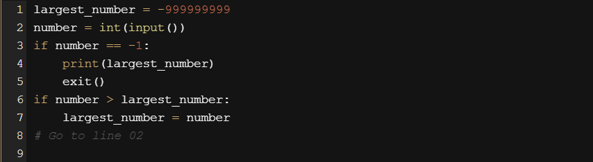

# Conditions and conditional execution
You already know how to ask Python questions, but you still don't know how to make reasonable use of the answers. You have to have a mechanism which will allow you to do something `if a condition is met, and not do it if it isn't`.

It's just like in real life: you do certain things or you don't when a specific condition is met or not, e.g., you go for a walk if the weather is good, or stay home if it's wet and cold.

To make such decisions, Python offers a special instruction. Due to its nature and its application, it's called a `conditional instruction` (or conditional statement).

There are several variants of it. We'll start with the simplest, increasing the difficulty slowly.

The first form of a conditional statement, which you can see below is written very informally but figuratively:
```py
if true_or_not:
    do_this_if_true
```

This conditional statement consists of the following, strictly necessary, elements in this and this order only:

  - the `if` keyword;
  - one or more white spaces;
  - an expression (a question or an answer) whose value will be interpreted solely in terms of `True` (when its value is non-zero) and `False` (when it is equal to zero);
  - a `colon` followed by a newline;
  - an `indented` instruction or set of instructions (at least one instruction is absolutely required); the `indentation` may be achieved in two ways - by inserting a particular number of spaces (the recommendation is to use `four spaces of indentation`), or by using the tab character; note: if there is more than one instruction in the indented part, the indentation should be the same in all lines; even though it may look the same if you use tabs mixed with spaces, it's important to make all indentations `exactly the same` - Python 3 `does not allow mixing spaces and tabs` for indentation.

How does that statement work?

  - If the `true_or_not` expression `represents the truth` (i.e., its value is not equal to zero), `the indented statement(s) will be executed`;
  - if the true_or_not expression `does not represent the truth` (i.e., its value is equal to zero), `the indented statement(s) will be omitted` (ignored), and the next executed instruction will be the one after the original indentation level.

In real life, we often express a desire:

if the weather is good, we'll go for a walk

then, we'll have lunch


As you can see, having lunch is `not a conditional activity` and doesn't depend on the weather.

Knowing what conditions influence our behavior, and assuming that we have the parameterless functions `go_for_a_walk()` and `have_lunch()`, we can write the following snippet:
```py
if the_weather_is_good:
    go_for_a_walk()
have_lunch()
```

====================================================================================================
# Conditional execution: the if statement
If a certain sleepless Python developer falls asleep when he or she counts 120 sheep, and the sleep-inducing procedure may be implemented as a special function named `sleep_and_dream()`, the whole code takes the following shape:
```py
if sheep_counter >= 120: # Evaluate a test expression
    sleep_and_dream() # Execute if test expression is True
```	

You can read it as: if `sheep_counter` is greater than or equal to `120`, then fall asleep and dream (i.e., execute the `sleep_and_dream` function.)

We've said that `conditionally executed statements have to be indented`. This creates a very legible structure, clearly demonstrating all possible execution paths in the code.

Take a look at the following code:
```py
if sheep_counter >= 120:
    make_a_bed()
    take_a_shower()
    sleep_and_dream()
feed_the_sheepdogs()
```

As you can see, making a bed, taking a shower and falling asleep and dreaming are all `executed conditionally` - when `sheep_counter` reaches the desired limit.

Feeding the sheepdogs, however, is `always done` (i.e., the `feed_the_sheepdogs()` function is not indented and does not belong to the `if` block, which means it is always executed.)

Now we're going to discuss another variant of the conditional statement, which also allows you to perform an additional action when the condition is not met.

# Conditional execution: the if-else statement
We started out with a simple phrase which read: If the weather is good, we will go for a walk.

Note - there is not a word about what will happen if the weather is bad. We only know that we won't go outdoors, but what we could do instead is not known. We may want to plan something in case of bad weather, too.

We can say, for example: If the weather is good, we will go for a walk, otherwise we will go to a theater.

Now we know what we'll do `if the conditions are met`, and we know what we'll do `if not everything goes our way`. In other words, we have a "Plan B".

Python allows us to express such alternative plans. This is done with a second, slightly more complex form of the conditional statement, the if-else statement:
```py
if true_or_false_condition:
    perform_if_condition_true
else:
    perform_if_condition_false
```

Thus, there is a new word: `else` - this is a keyword.

The part of the code which begins with `else` says what to do if the condition specified for the `if` is not met (note the `colon` after the word).

The if-else execution goes as follows:

  - if the condition evaluates to True (its value is not equal to zero), the perform_if_condition_true statement is executed, and the conditional statement comes to an end;
  - if the condition evaluates to False (it is equal to zero), the perform_if_condition_false statement is executed, and the conditional statement comes to an end.

====================================================================================================
# The if-else statement: more conditional execution
By using this form of conditional statement, we can describe our plans as follows:
```py
if the_weather_is_good:
    go_for_a_walk()
else:
    go_to_a_theater()
have_lunch()
```

If the weather is good, we'll go for a walk. Otherwise, we'll go to a theatre. No matter if the weather is good or bad, we'll have lunch afterwards (after the walk or after going to the theatre).

Everything we've said about indentation works in the same manner inside `the else branch`:
```py
if the_weather_is_good:
    go_for_a_walk()
    have_fun()
else:
    go_to_a_theater()
    enjoy_the_movie()
have_lunch()
```

# Nested if-else statements
Now let's discuss two special cases of the conditional statement.

First, consider the case where the `instruction placed after the if is another if`.

Read what we have planned for this Sunday. If the weather is fine, we'll go for a walk. If we find a nice restaurant, we'll have lunch there. Otherwise, we'll eat a sandwich. If the weather is poor, we'll go to the theater. If there are no tickets, we'll go shopping in the nearest mall.

Let's write the same in Python. Consider carefully the code here:
```py
if the_weather_is_good:
    if nice_restaurant_is_found:
        have_lunch()
    else:
        eat_a_sandwich()
else:
    if tickets_are_available:
        go_to_the_theater()
    else:
        go_shopping()
```

Here are two important points:

  - this use of the if statement is known as nesting; remember that every else refers to the if which lies at the same indentation level; you need to know this to determine how the ifs and elses pair up;
  - consider how the indentation improves readability, and makes the code easier to understand and trace.

# The elif statement
The second special case introduces another new Python keyword: `elif`. As you probably suspect, it's a shorter form of `else if`.

`elif` is used to `check more than just one condition`, and to `stop` when the first statement which is true is found.

Our next example resembles nesting, but the similarities are very slight. Again, we'll change our plans and express them as follows: If the weather is fine, we'll go for a walk, otherwise if we get tickets, we'll go to the theater, otherwise if there are free tables at the restaurant, we'll go for lunch; if all else fails, we'll return home and play chess.

Have you noticed how many times we've used the word otherwise? This is the stage where the `elif` keyword plays its role.

Let's write the same scenario using Python:
```py
if the_weather_is_good:
    go_for_a_walk()
elif tickets_are_available:
    go_to_the_theater()
elif table_is_available:
    go_for_lunch()
else:
    play_chess_at_home()
```

The way to assemble subsequent if-elif-else statements is sometimes called a `cascade`.

Notice again how the indentation improves the readability of the code.

Some additional attention has to be paid in this case:

  - you mustn't use else without a preceding if;
  - else is always the last branch of the cascade, regardless of whether you've used elif or not;
  - else is an optional part of the cascade, and may be omitted;
  - if there is an else branch in the cascade, only one of all the branches is executed;
  - if there is no else branch, it's possible that none of the available branches is executed.

This may sound a little puzzling, but hopefully some simple examples will help shed more light.

====================================================================================================
# Analyzing code samples
Now we're going to show you some simple yet complete programs. We won't explain them in detail, because we consider the comments (and the variable names) inside the code to be sufficient guides.

All the programs solve the same problem - they `find the largest of several numbers and print it out`.

## Example 1:

We'll start with the simplest case - `how to identify the larger of two numbers`:
```py
# Read two numbers
number1 = int(input("Enter the first number: "))
number2 = int(input("Enter the second number: "))

# Choose the larger number
if number1 > number2:
    larger_number = number1
else:
    larger_number = number2

# Print the result
print("The larger number is:", larger_number)
```

The above snippet should be clear - it reads two integer values, compares them, and finds which is the larger.

## Example 2:

Now we're going to show you one intriguing fact. Python has an interesting feature, look at the code below:
```py
# Read two numbers
number1 = int(input("Enter the first number: "))
number2 = int(input("Enter the second number: "))

# Choose the larger number
if number1 > number2: larger_number = number1
else: larger_number = number2

# Print the result
print("The larger number is:", larger_number)
```
++++++++++++++++++++++++++++++++++++++++++++++++++++++++++++++++
Note: if any of the if-elif-else branches contains just one instruction, you may code it in a more comprehensive form (you don't need to make an indented line after the keyword, but just continue the line after the colon).

This style, however, may be misleading, and we're not going to use it in our future programs, but it's definitely worth knowing if you want to read and understand someone else's programs.

There are no other differences in the code.
++++++++++++++++++++++++++++++++++++++++++++++++++++++++++++++++

## Example 3:

It's time to complicate the code - let's find the largest of three numbers. Will it enlarge the code? A bit.

We assume that the first value is the largest. Then we verify this hypothesis with the two remaining values.

Look at the code below:
```py
# Read three numbers
number1 = int(input("Enter the first number: "))
number2 = int(input("Enter the second number: "))
number3 = int(input("Enter the third number: "))

# We temporarily assume that the first number
# is the largest one.
# We will verify this soon.
largest_number = number1

# We check if the second number is larger than current largest_number
# and update largest_number if needed.
if number2 > largest_number:
    largest_number = number2

# We check if the third number is larger than current largest_number
# and update largest_number if needed.
if number3 > largest_number:
    largest_number = number3

# Print the result
print("The largest number is:", largest_number)
```

This method is significantly simpler than trying to find the largest number all at once, by comparing all possible pairs of numbers (i.e., first with second, second with third, third with first). Try to rebuild the code for yourself.

====================================================================================================
# Pseudocode and introduction to loops
You should now be able to write a program which finds the largest of four, five, six, or even ten numbers.

You already know the scheme, so extending the size of the problem will not be particularly complex.

But what happens if we ask you to write a program that finds the largest of two hundred numbers? Can you imagine the code?

You'll need two hundred variables. If two hundred variables isn't bad enough, try to imagine searching for the largest of a million numbers.

Imagine a code that contains 199 conditional statements and two hundred invocations of the `input()` function. Luckily, you don't need to deal with that. There's a simpler approach.

We'll ignore the requirements of Python syntax for now, and try to analyze the problem without thinking about the real programming. In other words, we'll try to write the `algorithm`, and when we're happy with it, we'll implement it.

In this case, we'll use a kind of notation which is not an actual programming language (it can be neither compiled nor executed), but it is formalized, concise and readable. It's called `pseudocode`.

Let's look at our pseudocode below:

What's happening in it?

Firstly, we can simplify the program if, at the very beginning of the code, we assign the variable `largest_number` with a value which will be smaller than any of the entered numbers. We'll use `-999999999` for that purpose.

Secondly, we assume that our algorithm will not know in advance how many numbers will be delivered to the program. We expect that the user will enter as many numbers as she/he wants - the algorithm will work well with one hundred and with one thousand numbers. How do we do that?

We make a deal with the user: when the value `-1` is entered, it will be a sign that there are no more data and the program should end its work.

Otherwise, if the entered value is not equal to `-1`, the program will read another number, and so on.

The trick is based on the assumption that any part of the code can be performed more than once - precisely, as many times as needed.

Performing a certain part of the code more than once is called a `loop`. The meaning of this term is probably obvious to you.

Lines `02` through `08` make a loop. We'll `pass through them as many times as needed` to review all the entered values.

Can you use a similar structure in a program written in Python? Yes, you can.


## Extra Info

Python often comes with a lot of built-in functions that will do the work for you. For example, to find the largest number of all, you can use a Python built-in function called `max()`. You can use it with multiple arguments. Analyze the code below:
```py
# Read three numbers.
number1 = int(input("Enter the first number: "))
number2 = int(input("Enter the second number: "))
number3 = int(input("Enter the third number: "))

# Check which one of the numbers is the greatest
# and pass it to the largest_number variable.

largest_number = max(number1, number2, number3)

# Print the result.
print("The largest number is:", largest_number)
```

By the same fashion, you can use the `min()` function to return the lowest number. You can rebuild the above code and experiment with it in the Sandbox.

We're going to talk about these (and many other) functions soon. For the time being, our focus will be put on conditional execution and loops to let you gain more confidence in programming and teach you the skills that will let you fully understand and apply the two concepts in your code. So, for now, we're not taking any shortcuts.