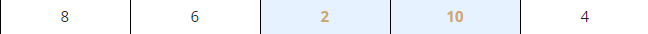

# The bubble sort
Now that you can effectively juggle the elements of lists, it's time to learn how to `sort` them. Many sorting algorithms have been invented so far, which differ a lot in speed, as well as in complexity. We are going to show you a very simple algorithm, easy to understand, but unfortunately not too efficient, either. It's used very rarely, and certainly not for large and extensive lists.

Let's say that a list can be sorted in two ways:

  - increasing (or more precisely - non-decreasing) - if in every pair of adjacent elements, the former element is not greater than the latter;
  - decreasing (or more precisely - non-increasing) - if in every pair of adjacent elements, the former element is not less than the latter.

In the following sections, we'll sort the list in increasing order, so that the numbers will be ordered from the smallest to the largest.

Here's the list:


We'll try to use the following approach: we'll take the first and the second elements and compare them; if we determine that they're in the wrong order (i.e., the first is greater than the second), we'll swap them round; if their order is valid, we'll do nothing. A glance at our list confirms the latter - the elements 01 and 02 are in the proper order, as in `8 < 10`.

Now look at the second and the third elements. They're in the wrong positions. We have to swap them:


We go further, and look at the third and the fourth elements. Again, this is not what it's supposed to be like. We have to swap them:


Now we check the fourth and the fifth elements. Yes, they too are in the wrong positions. Another swap occurs:


The first pass through the list is already finished. We're still far from finishing our job, but something curious has happened in the meantime. The largest element, `10`, has already gone to the end of the list. Note that this is the `desired place` for it. All the remaining elements form a picturesque mess, but this one is already in place.
Now, for a moment, try to imagine the list in a slightly different way - namely, like this:
|""""""""|
|   10   |
|""""""""|
|   4    |
|""""""""|
|   2    |
|""""""""|
|   6    |
|""""""""|
|   8    |
""""""""""

Look - `10` is at the top. We could say that it floated up from the bottom to the surface, just like the `bubble in a glass of champagne`. The sorting method derives its name from the same observation - it's called a `bubble sort`.

Now we start with the second pass through the list. We look at the first and second elements - a swap is necessary:
|"""""|"""""|"""""|"""""|"""""|
|` 6` |` 8 `|  2  |  4  |  10 |
"""""""""""""""""""""""""""""""
Time for the second and third elements: we have to swap them too:
|"""""|"""""|"""""|"""""|"""""|
|  6  |` 2 `|` 8 `|  4  |  10 |
"""""""""""""""""""""""""""""""
Now the third and fourth elements, and the second pass is finished, as `8` is already in place:
|"""""|"""""|"""""|"""""|"""""|
|  6  |  2  |` 4 `|` 8 `|  10 |
"""""""""""""""""""""""""""""""
We start the next pass immediately. Watch the first and the second elements carefully - another swap is needed:
|"""""|"""""|"""""|"""""|"""""|
|` 2 `|` 6 `|  4  |  8  |  10 |
"""""""""""""""""""""""""""""""
Now `6` needs to go into place. We swap the second and the third elements:
|"""""|"""""|"""""|"""""|"""""|
|  2  |` 4 `|` 6 `|  8  |  10 |
"""""""""""""""""""""""""""""""
The list is already sorted. We have nothing more to do. This is exactly what we want.

As you can see, the essence of this algorithm is simple: `we compare the adjacent elements, and by swapping some of them, we achieve our goal`.

Let's code in Python all the actions performed during a single pass through the list, and then we'll consider how many passes we actually need to perform it. We haven't explained this so far, and we'll do that a little later.

=================================================================================
# Sorting a list
How many passes do we need to sort the entire list?

We solve this issue in the following way: `we introduce another variable`; its task is to observe if any swap has been done during the pass or not; if there is no swap, then the list is already sorted, and nothing more has to be done. We create a variable named `swapped`, and we assign a value of `False` to it, to indicate that there are no swaps. Otherwise, it will be assigned `True`.
```py
my_list = [8, 10, 6, 2, 4]  # list to sort

for i in range(len(my_list) - 1):  # we need (5 - 1) comparisons
    if my_list[i] > my_list[i + 1]:  # compare adjacent elements
        my_list[i], my_list[i + 1] = my_list[i + 1], my_list[i]  # If we end up here, we have to swap the elements.
```

You should be able to read and understand this program without any problems:
```py
my_list = [8, 10, 6, 2, 4]  # list to sort
swapped = True  # It's a little fake, we need it to enter the while loop.

while swapped:
    swapped = False  # no swaps so far
    for i in range(len(my_list) - 1):
        if my_list[i] > my_list[i + 1]:
            swapped = True  # a swap occurred!
            my_list[i], my_list[i + 1] = my_list[i + 1], my_list[i]

print(my_list)
```

Run the program and test it.

=================================================================================
# The bubble sort - interactive version
In the editor you can see a complete program, enriched by a conversation with the user, and allowing the user to enter and to print elements from the list: `The bubble sort - final interactive version`.

Python, however, has its own sorting mechanisms. No one needs to write their own sorts, as there is a sufficient number of `ready-to-use tools`.

We explained this sorting system to you because it's important to learn how to process a list's contents, and to show you how real sorting may work.

If you want Python to sort your list, you can do it like this:
```py
my_list = [8, 10, 6, 2, 4]
my_list.sort()
print(my_list)
```

It is as simple as that.
```py
my_list = []
swapped = True
num = int(input("How many elements do you want to sort: "))

for i in range(num):
    val = float(input("Enter a list element: "))
    my_list.append(val)

while swapped:
    swapped = False
    for i in range(len(my_list) - 1):
        if my_list[i] > my_list[i + 1]:
            swapped = True
            my_list[i], my_list[i + 1] = my_list[i + 1], my_list[i]

print("\nSorted:")
print(my_list)
```
The snippet's output is as follows:

[2, 4, 6, 8, 10]
output


As you can see, all the lists have a method named `sort()`, which sorts them as fast as possible. You've already learned about some of the list methods before, and you're going to learn more about others very soon.

