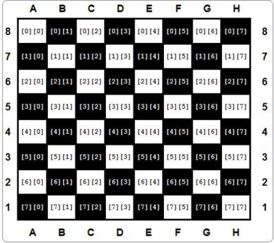

# Lists in lists
Lists can consist of scalars (namely numbers) and elements of a much more complex structure (you've already seen such examples as strings, booleans, or even other lists in the previous Section Summary lessons). Let's have a closer look at the case where a `list's elements are just lists`.

We often find such `arrays` in our lives. Probably the best example of this is a `chessboard`.

A chessboard is composed of rows and columns. There are eight rows and eight columns. Each column is marked with the letters A through H. Each line is marked with a number from one to eight.

The location of each field is identified by letter-digit pairs. Thus, we know that the bottom left corner of the board (the one with the white rook) is A1, while the opposite corner is H8.


Let's assume that we're able to use the selected numbers to represent any chess piece. We can also assume that `every row on the chessboard is a list`.

Look at the code below:
```py
row = []

for i in range(8):
    row.append(WHITE_PAWN)
```

It builds a list containing eight elements representing the second row of the chessboard - the one filled with pawns (assume that `WHITE_PAWN` is a `predefined symbol` representing a white pawn).

The same effect may be achieved by means of a `list comprehension`, the special syntax used by Python in order to fill massive lists.

A list comprehension is actually a list, but `created on-the-fly during program execution, and is not described statically`.

Take a look at the snippet:
```py
row = [WHITE_PAWN for i in range(8)]
```

The part of the code placed inside the brackets specifies:

  - the data to be used to fill the list (`WHITE_PAWN`)
  - the clause specifying how many times the data occurs inside the list (`for i in range(8)`)

Let us show you some other `list comprehension examples`:

Example #1:
```py
squares = [x ** 2 for x in range(10)]
```

The snippet produces a ten-element list filled with squares of ten integer numbers starting from zero (0, 1, 4, 9, 16, 25, 36, 49, 64, 81)

Example #2:
```py
twos = [2 ** i for i in range(8)]
```

The snippet creates an eight-element array containing the first eight powers of two (1, 2, 4, 8, 16, 32, 64, 128)

Example #3:
```py
odds = [x for x in squares if x % 2 != 0 ]
```

The snippet makes a list with only the odd elements of the `squares` list.

============================================================================================
# Lists in lists: two-dimensional arrays
Let's also assume that a `predefined symbol` named `EMPTY` designates an empty field on the chessboard.

So, if we want to create a list of lists representing the whole chessboard, it may be done in the following way:
```py
board = []

for i in range(8):
    row = [EMPTY for i in range(8)]
    board.append(row)
```

Note:

  - the inner part of the loop creates a row consisting of eight elements (each of them equal to `EMPTY`) and appends it to the `board` list;
  - the outer part repeats it eight times;
  - in total, the `board` list consists of 64 elements (all equal to `EMPTY`)

This model perfectly mimics the real chessboard, which is in fact an eight-element list of elements, all being single rows. Let's summarize our observations:

  - the elements of the rows are fields, eight of them per row;
  - the elements of the chessboard are rows, eight of them per chessboard.

The board `variable` is now a `two-dimensional array`. It's also called, by analogy to algebraic terms, a `matrix`.

As list comprehensions can be nested, we can shorten the board creation in the following way:
```py
board = [[EMPTY for i in range(8)] for j in range(8)]
```

The inner part creates a row, and the outer part builds a list of rows.

====================================================================================
# Lists in lists: two-dimensional arrays - continued
Access to the selected field of the board requires two indices - the first selects the row; the second - the field number inside the row, which is de facto a column number.

Take a look at the chessboard. Every field contains a pair of indices which should be given to access the field's content:

Glancing at the figure shown above, let's set some chess pieces on the board. First, let's add all the rooks:
```py
board[0][0] = ROOK
board[0][7] = ROOK
board[7][0] = ROOK
board[7][7] = ROOK
```

If you want to add a knight to C4, you do it as follows:
```py
board[4][2] = KNIGHT
```

And now a pawn to E5:
```py
board[3][4] = PAWN
```

And now - experiment with the code in the editor.
```py
EMPTY = "-"
ROOK = "ROOK"
board = []

for i in range(8):
    row = [EMPTY for i in range(8)]
    board.append(row)

board[0][0] = ROOK
board[0][7] = ROOK
board[7][0] = ROOK
board[7][7] = ROOK

print(board)
```

====================================================================================
# Multidimensional nature of lists: advanced applications
Let's go deeper into the multidimensional nature of lists. To find any element of a two-dimensional list, you have to use two coordinates:

  - a vertical one (row number)
  - and a horizontal one (column number).

Imagine that you develop a piece of software for an automatic weather station. The device records the air temperature on an hourly basis and does it throughout the month. This gives you a total of 24 × 31 = 744 values. Let's try to design a list capable of storing all these results.

First, you have to decide which data type would be adequate for this application. In this case, a `float` would be best, since this thermometer is able to measure the temperature with an accuracy of 0.1 ℃.

Then you take an arbitrary decision that the rows will record the readings every hour on the hour (so the row will have 24 elements) and each of the rows will be assigned to one day of the month (let's assume that each month has 31 days, so you need 31 rows). Here's the appropriate pair of comprehensions (`h` is for hour, `d` for day):
```py
temps = [[0.0 for h in range(24)] for d in range(31)]
```

The whole matrix is filled with zeros now. You can assume that it's updated automatically using special hardware agents. The thing you have to do is to wait for the matrix to be filled with measurements.

Now it's time to determine the monthly average noon temperature. Add up all 31 readings recorded at noon and divide the sum by 31. You can assume that the midnight temperature is stored first. Here's the relevant code:
```py
temps = [[0.0 for h in range(24)] for d in range(31)]
#
# The matrix is magically updated here.
#

total = 0.0

for day in temps:
    total += day[11]

average = total / 31

print("Average temperature at noon:", average)
```

Note: the `day` variable used by the `for` loop is not a scalar - each pass through the `temps` matrix assigns it with the subsequent rows of the matrix; hence, it's a list. It has to be indexed with `11` to access the temperature value measured at noon.

Now find the highest temperature during the whole month - see the code:
```py
temps = [[0.0 for h in range(24)] for d in range(31)]
#
# The matrix is magically updated here.
#

highest = -100.0

for day in temps:
    for temp in day:
        if temp > highest:
            highest = temp

print("The highest temperature was:", highest)
```

Note:

  - the `day` variable iterates through all the rows in the `temps` matrix;
  - the `temp` variable iterates through all the measurements taken in one day.

Now count the days when the temperature at noon was at least 20 ℃:
```py
temps = [[0.0 for h in range(24)] for d in range(31)]
#
# The matrix is magically updated here.
#

hot_days = 0

for day in temps:
    if day[11] > 20.0:
        hot_days += 1

print(hot_days, "days were hot.")
```

====================================================================================
# Three-dimensional arrays
Python does not limit the depth of list-in-list inclusion. Here you can see an example of a three-dimensional array:

Imagine a hotel. It's a huge hotel consisting of three buildings, 15 floors each. There are 20 rooms on each floor. For this, you need an array which can collect and process information on the occupied/free rooms.

First step - the type of the array's elements. In this case, a Boolean value (`True`/`False`) would fit.

Step two - calm analysis of the situation. Summarize the available information: three buildings, 15 floors, 20 rooms.

Now you can create the array:
```py
rooms = [[[False for r in range(20)] for f in range(15)] for t in range(3)]
```

The first index (`0` through `2`) selects one of the buildings; the second (`0` through `14`) selects the floor, the third (`0` through `19`) selects the room number. All rooms are initially free.

Now you can book a room for two newlyweds: in the second building, on the tenth floor, room 14:
```py
rooms[1][9][13] = True
```

and release the second room on the fifth floor located in the first building:
```py
rooms[0][4][1] = False
```

Check if there are any vacancies on the 15th floor of the third building:
```py
vacancy = 0

for room_number in range(20):
    if not rooms[2][14][room_number]:
        vacancy += 1
```

The `vacancy` variable contains `0` if all the rooms are occupied, or the number of available rooms otherwise.
Congratulations! You've made it to the end of the module. Keep up the good work!

```py
rooms = [[[False for r in range(20)] for f in range(15)] for t in range(3)]
```