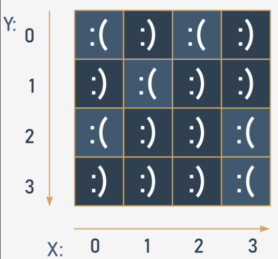
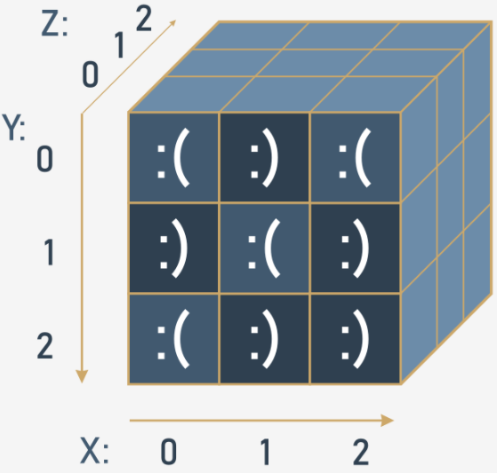

# Key takeaways
1. `List comprehension` allows you to create new lists from existing ones in a concise and elegant way. The syntax of a list comprehension looks as follows:
```py
[expression for element in list if conditional]
```

which is actually an equivalent of the following code:
```py
for element in list:
    if conditional:
        expression
```

Here's an example of a list comprehension - the code creates a five-element list filled with with the first five natural numbers raised to the power of 3:
```py
cubed = [num ** 3 for num in range(5)]
print(cubed)  # outputs: [0, 1, 8, 27, 64]
```

2. You can use nested lists in Python to create matrices (i.e., two-dimensional lists). For example:


```py
# A four-column/four-row table - a two dimensional array (4x4)

table = [[":(", ":)", ":(", ":)"],
         [":)", ":(", ":)", ":)"],
         [":(", ":)", ":)", ":("],
         [":)", ":)", ":)", ":("]]

print(table)
print(table[0][0])  # outputs: ':('
print(table[0][3])  # outputs: ':)'

```

3. You can nest as many lists in lists as you want, and therefore create n-dimensional lists, e.g., three-, four- or even sixty-four-dimensional arrays. For example:


```py
# Cube - a three-dimensional array (3x3x3)

cube = [[[':(', 'x', 'x'],
         [':)', 'x', 'x'],
         [':(', 'x', 'x']],

        [[':)', 'x', 'x'],
         [':(', 'x', 'x'],
         [':)', 'x', 'x']],

        [[':(', 'x', 'x'],
         [':)', 'x', 'x'],
         [':)', 'x', 'x']]]

print(cube)
print(cube[0][0][0])  # outputs: ':('
print(cube[2][2][0])  # outputs: ':)'

```