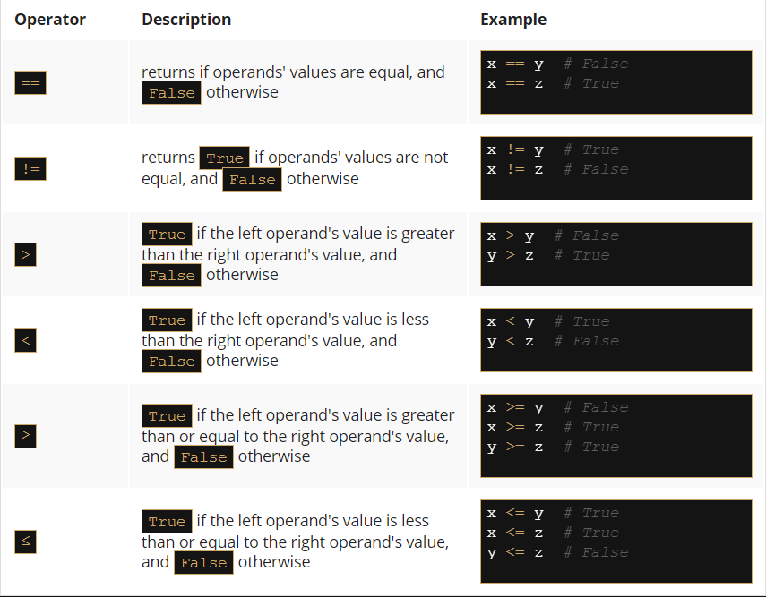

# Key takeaways

1. The comparison (or the so-called relational) operators are used to compare values. The table below illustrates how the comparison operators work, assuming that x = 0, y = 1, and z = 0:


2. When you want to execute some code only if a certain condition is met, you can use a `conditional statement`:

  - a single if statement, e.g.:
```py
x = 10

if x == 10: # condition
    print("x is equal to 10")  # Executed if the condition is True.

```
  - a series of if statements, e.g.:
```py
x = 10

if x > 5: # condition one
    print("x is greater than 5")  # Executed if condition one is True.

if x < 10: # condition two
    print("x is less than 10")  # Executed if condition two is True.

if x == 10: # condition three
    print("x is equal to 10")  # Executed if condition three is True.
```    

Each `if` statement is tested separately.

  - an if-else statement, e.g.:
```py
x = 10

if x < 10:  # Condition
    print("x is less than 10")  # Executed if the condition is True.

else:
    print("x is greater than or equal to 10")  # Executed if the condition is False.
```

  - a series of `if` statements followed by an `else`, e.g.:
```py
x = 10

if x > 5:  # True
    print("x > 5")

if x > 8:  # True
    print("x > 8")

if x > 10:  # False
    print("x > 10")

else:
    print("else will be executed")
```

Each `if` is tested separately. The body of `else` is executed if the last `if` is `False`.

  - The `if-elif-else` statement, e.g.:
```py
x = 10

if x == 10:  # True
    print("x == 10")

if x > 15:  # False
    print("x > 15")

elif x > 10:  # False
    print("x > 10")

elif x > 5:  # True
    print("x > 5")

else:
    print("else will not be executed")
```

If the condition for `if` is `False`, the program checks the conditions of the subsequent `elif` blocks - the first `elif` block that is `True` is executed. If all the conditions are `False`, the `else` block will be executed.

  - Nested conditional statements, e.g.:
```py
x = 10

if x > 5:  # True
    if x == 6:  # False
        print("nested: x == 6")
    elif x == 10:  # True
        print("nested: x == 10")
    else:
        print("nested: else")
else:
    print("else")
```

==============================================================================================
# Key takeaways: continued

## Exercise 1
Q: What is the output of the following snippet?
```py
x = 5
y = 10
z = 8

print(x > y)
print(y > z)
```

False
True

## Exercise 2
Q: What is the output of the following snippet?
```py
x, y, z = 5, 10, 8

print(x > z)
print((y - 5) == x)
```

False
True

## Exercise 3
Q: What is the output of the following snippet?
```py
x, y, z = 5, 10, 8
x, y, z = z, y, x

print(x > z)
print((y - 5) == x)
```

True
False

## Exercise 4
Q: What is the output of the following snippet?
```py
x = 10

if x == 10:
    print(x == 10)
if x > 5:
    print(x > 5)
if x < 10:
    print(x < 10)
else:
    print("else")
```

True
True
else

## Exercise 5
Q: What is the output of the following snippet?
```py
x = "1"

if x == 1:
    print("one")
elif x == "1":
    if int(x) > 1:
        print("two")
    elif int(x) < 1:
        print("three")
    else:
        print("four")
if int(x) == 1:
    print("five")
else:
    print("six")
```

four
five

## Exercise 6
Q: What is the output of the following snippet?
```py
x = 1
y = 1.0
z = "1"

if x == y:
    print("one")
if y == int(z):
    print("two")
elif x == y:
    print("three")
else:
    print("four")
```

one
two
