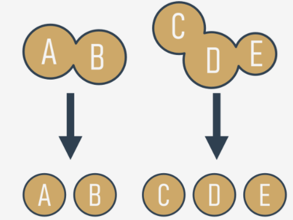

# Why do we need functions?
You've come across `functions many` times so far, but the view on their merits that we have given you has been rather one-sided. You've only invoked the functions by using them as tools to make life easier, and to simplify time-consuming and tedious tasks.

When you want some data to be printed on the console, you use `print()`. When you want to read the value of a variable, you use input(), coupled with either `int()` or `float()`.

You've also made use of some `methods`, which are in fact functions, but declared in a very specific way.

Now you'll learn how to write your own functions, and how to use them. We'll write several functions together, from the very simple to the rather complex, which will require your focus and attention.


It often happens that a particular piece of code is `repeated many times in your program`. It's repeated either literally, or with only a few minor modifications, consisting of the use of other variables in the same algorithm. It also happens that a programmer cannot resist simplifying the work, and begins to clone such pieces of code using the clipboard and copy-paste operations.

It could end up as greatly frustrating when suddenly it turns out that there was an error in the cloned code. The programmer will have a lot of drudgery to find all the places that need corrections. There's also a high risk of the corrections causing errors.

We can now define the first condition which can help you decide when to start writing your own functions: `if a particular fragment of the code begins to appear in more than one place, consider the possibility of isolating it in the form of a function` invoked from the points where the original code was placed before.


It may happen that the algorithm you're going to implement is so complex that your code begins to grow in an uncontrolled manner, and suddenly you notice that you're not able to navigate through it so easily anymore.

You can try to cope with the issue by commenting the code extensively, but soon you find that this dramatically worsens your situation - `too many comments make the code larger and harder to read`. Some say that a `well-written function should be viewed entirely in one glance`.

A good and attentive developer `divides the code` (or more accurately: the problem) into well-isolated pieces, and `encodes each of them in the form of a function`.

This considerably simplifies the work of the program, because each piece of code can be encoded separately, and tested separately. The process described here is often called `decomposition`.



We can now state the second condition: `if a piece of code becomes so large that reading and understating it may cause a problem, consider dividing it into separate, smaller problems, and implement each of them in the form of a separate function`.

This decomposition continues until you get a set of short functions, easy to understand and test.

=====================================================================================================
# Decomposition
It often happens that the problem is so large and complex that it cannot be assigned to a single developer, and a `team of developers` have to work on it. The problem must be split between several developers in a way that ensures their efficient and seamless cooperation.
```
,,,,,,,,,,,,,                   ,,,,,,,,,,,,,
|           |                   |           |
|  { Code}  | <-----work------> | {Python}  |
|           |                   |           |
'''''''''''''                   '''''''''''''
```
It seems inconceivable that more than one programmer should write the same piece of code at the same time, so the job has to be dispersed among all the team members.

This kind of decomposition has a different purpose to the one described previously - it's not only about `sharing the work`, but also about `sharing the responsibility` among many developers.

Each of them writes a clearly defined and described set of functions, which when `combined into the module` (we'll tell you about this a bit later) will give the final product.

This leads us directly to the third condition: if you're going to divide the work among multiple programmers, `decompose the problem to allow the product to be implemented as a set of separately written functions packed together in different modules`.

# Where do the functions come from?
In general, functions come from at least three places:

  - from Python itself - numerous functions (like `print()`) are an `integral part of Python`, and are always available without any additional effort on behalf of the programmer; we call these functions `built-in functions`;
  - from Python's `preinstalled modules` - a lot of functions, very useful ones, but used significantly less often than built-in ones, are available in a number of modules installed together with Python; the use of these functions requires some additional steps from the programmer in order to make them fully accessible (we'll tell you about this in a while);
  - `directly from your code` - you can write your own functions, place them inside your code, and use them freely;
  - there is one other possibility, but it's connected with classes, so we'll omit it for now.

functions come from:
   1. python
   2. modules
   3. code