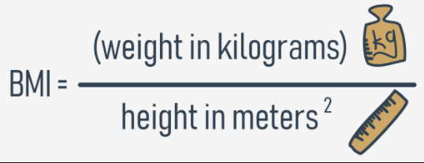

# Some simple functions: evaluating the BMI
Let's get started on a function to evaluate the Body Mass Index (BMI).


As you can see, the formula gets two values:

  - weight (originally in kilograms)
  - height (originally in meters)

It seems that this new function will have `two parameters`. Its name will be `bmi`, but if you prefer any other name, use it instead.

Let's code the function:
```py
def bmi(weight, height):
    return weight / height ** 2

print(bmi(52.5, 1.65))
```

The result produced by the sample invocation looks as follows:
```s
19.283746556473833
```
output

The function fulfils our expectations, but it's a bit simple - it assumes that the values of both parameters are always meaningful. It's definitely worth checking if they're trustworthy.

Let's check them both and return `None` if any of them looks suspicious.

===============================================================================
# Some simple functions: evaluating BMI and converting imperial units to metric units
Look at the code in the editor. There are two things we need to pay attention to.
```py
def bmi(weight, height):
    if height < 1.0 or height > 2.5 or \
    weight < 20 or weight > 200:
        return None

    return weight / height ** 2


print(bmi(352.5, 1.65))
```
First, the test invocation ensures that the `protection` works properly - the output is:
```s
None
```
output


Second, take a look at the way the `backslash` (`\`) symbol is used. If you use it in Python code and end a line with it, it will tell Python to continue the line of code in the next line of code.

It can be particularly useful when you have to deal with long lines of code and you'd like to improve code readability.

Okay, but there's something we omitted too easily - the imperial measurements. This function is not too useful for people accustomed to pounds, feet and inches.

What can be done for them?

We can write two simple functions to `convert imperial units to metric ones`. Let's start with pounds.

It is a well-known fact that `1 lb = 0.45359237 kg`. We'll use this in our new function.

This is our helper function, named `lb_to_kg`:
```py
def lb_to_kg(lb):
    return lb * 0.45359237


print(lb_to_kg(1))
```

The result of the test invocation looks good:
```
0.45359237
```
output


And now it's time for feet and inches: `1 ft = 0.3048 m`, and `1 in = 2.54 cm = 0.0254 m`.

The function we've written is named `ft_and_inch_to_m`:
```py
def ft_and_inch_to_m(ft, inch):
    return ft * 0.3048 + inch * 0.0254

print(ft_and_inch_to_m(1, 1))
```

The result of a quick test is:
```s
0.3302
```
output

It looks as expected.

Note: we wanted to name the second parameter just `in`, not `inch`, but we couldn't. Do you know why?

`in` is a Python `keyword` - it cannot be used as a name.

Let's convert six feet into meters:
```py
print(ft_and_inch_to_m(6, 0))
```

And this is the output:
```s
1.8288000000000002
```
output

It's quite possible that sometimes you may want to use just feet without inches. Will Python help you? Of course it will.

We've modified the code a bit:
```py
def ft_and_inch_to_m(ft, inch = 0.0):
    return ft * 0.3048 + inch * 0.0254

print(ft_and_inch_to_m(6))
```

Now the inch parameter has its default value equal to 0.0.

The code produces the following output - this is what is expected:
```s
1.8288000000000002
```
output

Finally, the code is able to answer the question: what is the BMI of a person 5'7" tall and weighing 176 lbs?

This is the code we have built:
```py
def ft_and_inch_to_m(ft, inch = 0.0):
    return ft * 0.3048 + inch * 0.0254


def lb_to_kg(lb):
    return lb * 0.45359237


def bmi(weight, height):
    if height < 1.0 or height > 2.5 or weight < 20 or weight > 200:
        return None
    
    return weight / height ** 2


print(bmi(weight = lb_to_kg(176), height = ft_and_inch_to_m(5, 7)))
```

And the answer is:
```s
27.565214082533313
```
output

Run the code and test it.
