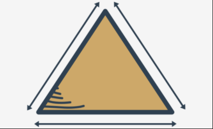

Some simple functions: continued
Let's play with triangles now. We'll start with a function to check whether three sides of given lengths can build a triangle.


We know from school that the sum of two arbitrary sides has to be longer than the third side.

It won't be a hard challenge. The function will have `three parameters` - one for each side.

It will return `True` if the sides can build a triangle, and `False` otherwise. In this case, `is_a_triangle` is a good name for such a function.

Look at the code in the editor. You can find our function there. Run the program.
```py
def is_a_triangle(a, b, c):
    if a + b <= c:
        return False
    if b + c <= a:
        return False
    if c + a <= b:
        return False
    return True


print(is_a_triangle(1, 1, 1))
print(is_a_triangle(1, 1, 3))
```
It seems that it works well - these are the results:
```s
True
False
```
output


Can we make it more compact? It looks a bit wordy.

This is a more compact version:
```py
def is_a_triangle(a, b, c):
    if a + b <= c or b + c <= a or c + a <= b:
        return False
    return True


print(is_a_triangle(1, 1, 1))
print(is_a_triangle(1, 1, 3))
```

Can we compact it even more?

Yes, we can - look:
```py
def is_a_triangle(a, b, c):
    return a + b > c and b + c > a and c + a > b


print(is_a_triangle(1, 1, 1))
print(is_a_triangle(1, 1, 3))
```

We've negated the condition (reversed the relational operators and replaced `or`s with `and`s, receiving a `universal expression for testing triangles`).

Let's install the function in a larger program. It'll ask the user for three values and make use of the function.

