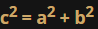
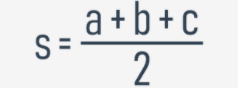
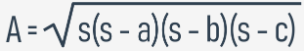

# Some simple functions: triangles and the Pythagorean theorem
Look at the code in the editor. It asks the user for three values. Then it makes use of the `is_a_triangle` function. The code is ready to run.
```py
def is_a_triangle(a, b, c):
    return a + b > c and b + c > a and c + a > b

a = float(input('Enter the first side\'s length: '))
b = float(input('Enter the second side\'s length: '))
c = float(input('Enter the third side\'s length: '))

if is_a_triangle(a, b, c):
    print('Yes, it can be a triangle.')
else:
    print('No, it can\'t be a triangle.')
```

In the second step, we'll try to ensure that a certain triangle is a `right-angle triangle`.

We will need to make use of the `Pythagorean theorem`:



How do we recognize which of the three sides is the hypotenuse?

`The hypotenuse is the longest side`.

Here is the code:
```py
def is_a_triangle(a, b, c):
    return a + b > c and b + c > a and c + a > b

def is_a_right_triangle(a, b, c):
    if not is_a_triangle(a, b, c):
        return False
    if c > a and c > b:
        return c ** 2 == a ** 2 + b ** 2
    if a > b and a > c:
        return a ** 2 == b ** 2 + c ** 2


print(is_a_right_triangle(5, 3, 4))
print(is_a_right_triangle(1, 3, 4))
```

Look at how we test the relationship between the hypotenuse and the remaining sides - we choose the longest side, and apply the `Pythagorean theorem` to check if everything is right. This requires three checks in total.

===================================================================================
# Some simple functions: evaluating a triangle's area
We can also evaluate a triangle's area. `Heron's formula` will be handy here:

  |   
We're going use the exponentiation operator to find the square root - it may seem strange, but it works:


This is the resulting code:
```py
def is_a_triangle(a, b, c):
    return a + b > c and b + c > a and c + a > b

def heron(a, b, c):
    p = (a + b + c) / 2
    return (p * (p - a) * (p - b) * (p - c)) ** 0.5

def area_of_triangle(a, b, c):
    if not is_a_triangle(a, b, c):
        return None
    return heron(a, b, c)

print(area_of_triangle(1., 1., 2. ** .5))
```

We try it with a right-angle triangle as a half of a square with one side equal to 1. This means that its area should be equal to 0.5.

It's odd - the code produces the following output:
```s
0.49999999999999983
```
output

It's very close to 0.5, but it isn't exactly 0.5. What does it mean? Is it an error?
```py
def is_a_triangle(a, b, c):
    return a + b > c and b + c > a and c + a > b

a = float(input('Enter the first side\'s length: '))
b = float(input('Enter the second side\'s length: '))
c = float(input('Enter the third side\'s length: '))

if is_a_triangle(a, b, c):
    print('Yes, it can be a triangle.')
else:
    print('No, it can\'t be a triangle.')
```

No, it isn't. This is `the specifics of floating-point calculations`. We'll tell you more about it soon.