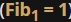
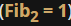
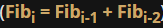

# Some simple functions: factorials
Another function we're about to write is `factorials`. Do you remember how a factorial is defined?
```
0! = 1 (yes! it's true)
1! = 1
2! = 1 * 2
3! = 1 * 2 * 3
4! = 1 * 2 * 3 * 4
:
:
n! = 1 * 2 ** 3 * 4 * ... * n-1 * n
```
It's marked with an `exclamation mark`, and is equal to the `product` of all natural numbers from one up to its argument.

Let's write our code. We'll create a function and call it `factorial_function`. Here is the code:
```py
def factorial_function(n):
    if n < 0:
        return None
    if n < 2:
        return 1
    
    product = 1
    for i in range(2, n + 1):
        product *= i
    return product


for n in range(1, 6):  # testing
    print(n, factorial_function(n))
```

Notice how we mirror step by step the mathematical definition, and how we use the `for` loop to `find the product`.

We add a simple testing code, and these are the results we get:
```s
1 1
2 2
3 6
4 24
5 120
```
output

==================================================================================
# Some simple functions: Fibonacci numbers
Are you familiar with `Fibonacci` numbers?

They are a `sequence of integer numbers` built using a very simple rule:

  - the first element of the sequence is equal to one 
  - the second is also equal to one 
  - every subsequent number is the the_sum of the two preceding numbers: 

Here are some of the first Fibonacci numbers:
```
fib_1 = 1
fib_2 = 1
fib_3 = 1 + 1 = 2
fib_4 = 1 + 2 = 3
fib_5 = 2 + 3 = 5
fib_6 = 3 + 5 = 8
fib_7 = 5 + 8 = 13
```
What do you think about `implementing this as a function`?

Let's create our `fib` function and test it. Here it is:
```py
def fib(n):
    if n < 1:
        return None
    if n < 3:
        return 1

    elem_1 = elem_2 = 1
    the_sum = 0
    for i in range(3, n + 1):
        the_sum = elem_1 + elem_2
        elem_1, elem_2 = elem_2, the_sum
    return the_sum


for n in range(1, 10):  # testing
    print(n, "->", fib(n))
```

Analyze the `for` loop body carefully, and find out how we `move the elem_1 and elem_2 variables through the subsequent Fibonacci numbers`.

The test part of the code produces the following output:
```s
1 -> 1
2 -> 1
3 -> 2
4 -> 3
5 -> 5
6 -> 8
7 -> 13
8 -> 21
9 -> 34
```
output


