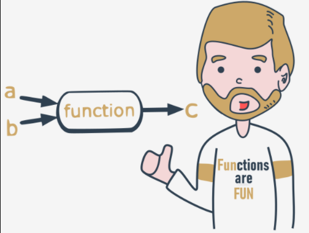

# Parameterized functions
The function's full power reveals itself when it can be equipped with an interface that is able to accept data provided by the invoker. Such data can modify the function's behavior, making it more flexible and adaptable to changing conditions.

A parameter is actually a variable, but there are two important factors that make parameters different and special:

  - `parameters exist only inside functions in which they have been defined`, and the only place where the parameter can be defined is a space between a pair of parentheses in the `def` statement;
  - `assigning a value to the parameter is done at the time of the function's invocation`, by specifying the corresponding argument.
```py
def function(parameter):
    ###
```

Don't forget:

  - `parameters live inside functions` (this is their natural environment)
  - `arguments exist outside functions`, and are carriers of values passed to corresponding parameters.

There is a clear and unambiguous frontier between these two worlds.

Let's enrich the function above with just one parameter - we're going to use it to show the user the number of a value the function asks for.

We have to rebuild the `def` statement - this is how it looks now:
```py
def message(number):
    ###
```

The definition specifies that our function operates on just one parameter named `number`. You can use it as an ordinary variable, but `only inside the function` - it isn't visible anywhere else.

Let's now improve the function's body:
```py
def message(number):
    print("Enter a number:", number)
```

We've made use of the parameter. Note: we haven't assigned the parameter with any value. Is it correct?

Yes, it is.

A value for the parameter will arrive from the function's environment.

Remember: `specifying one or more parameters in a function's definition` is also a requirement, and you have to fulfil it during invocation. You must `provide as many arguments as there are defined parameters`.

Failure to do so will cause an error.

===========================================================================================
# Parametrized functions: continued
```py
Try to run the code in the editor.
def message(number):
    print("Enter a number:", number)

message()
```
This is what you'll see in the console:
```s
TypeError: message() missing 1 required positional argument: 'number'
```
output


This looks better, for sure:
```py
def message(number):
    print("Enter a number:", number)

message(1)
```

Moreover, it behaves better. The code will produce the following output:
```s
Enter a number: 1
```
output


Can you see how it works? The value of the argument used during invocation (`1`) has been passed into the function, setting the initial value of the parameter named `number`.

We have to make you sensitive to one important circumstance.

It's legal, and possible, to have a `variable named the same as a function's parameter`.

The snippet illustrates the phenomenon:
```py
def message(number):
    print("Enter a number:", number)

number = 1234
message(1)
print(number)
```

A situation like this activates a mechanism called `shadowing`:

  - parameter `x` shadows any variable of the same name, but...
  - ... only inside the function defining the parameter.

The parameter named `number` is a completely different entity from the variable named `number`.

This means that the snippet above will produce the following output:
```s
Enter a number: 1
1234
```

===========================================================================================
# Parametrized functions: continued
A function can have `as many parameters as you want`, but the more parameters you have, the harder it is to memorize their roles and purposes.


Let's modify the function - it has `two parameters` now:
```py
def message(what, number):
    print("Enter", what, "number", number)
```

This also means that invoking the function will require `two arguments`.

The first new parameter is intended to carry the name of the desired value.

Here it is:
```py
def message(what, number):
    print("Enter", what, "number", number)

message("telephone", 11)
message("price", 5)
message("number", "number")
```


This is the output you're about to see:
```s
Enter telephone number 11
Enter price number 5
Enter number number number
output
```

Run the code, modify it, add more parameters, and see how this affects the output.
```py
def message(what, number):
    print("Enter", what, "number", number)

# invoke the function
```

===========================================================================================
# Positional parameter passing
A technique which assigns the ith (first, second, and so on) argument to the ith (first, second, and so on) function parameter is called `positional parameter passing`, while arguments passed in this way are named `positional arguments`.

You've used it already, but Python can offer a lot more. We're going to tell you about it now.
```py
def my_function(a, b, c):
    print(a, b, c)

my_function(1, 2, 3)
```

Note: positional parameter passing is intuitively used by people in many social occasions. For example, it may be generally accepted that when we introduce ourselves we mention our first name(s) before our last name, e.g., "My name's John Doe."

Incidentally, Hungarians do it in reverse order.

Let's implement that social custom in Python. The following function will be responsible for introducing somebody:
```py
def introduction(first_name, last_name):
    print("Hello, my name is", first_name, last_name)

introduction("Luke", "Skywalker")
introduction("Jesse", "Quick")
introduction("Clark", "Kent")
```

Can you guess the output? Run the code and find out if you were right.


Now imagine that the same function is being used in Hungary. In this case, the code would look like this:
```py
def introduction(first_name, last_name):
    print("Hello, my name is", first_name, last_name)

introduction("Skywalker", "Luke")
introduction("Quick", "Jesse")
introduction("Kent", "Clark")
```

The output will look different. Can you guess it?

Run the code to see if you were right here, too. Are you surprised?

Can you make the function more culture-independent?

===========================================================================================
# Keyword argument passing
Python offers another convention for passing arguments, where `the meaning of the argument is dictated by its name`, not by its position - it's called `keyword argument passing`.

Take a look at the snippet:
```py
def introduction(first_name, last_name):
    print("Hello, my name is", first_name, last_name)

introduction(first_name = "James", last_name = "Bond")
introduction(last_name = "Skywalker", first_name = "Luke")
```

The concept is clear - the values passed to the parameters are preceded by the target parameters' names, followed by the `=` sign.

The position doesn't matter here - each argument's value knows its destination on the basis of the name used.

You should be able to predict the output. Run the code to check if you were right.

Of course, you `mustn't use a non-existent parameter name`.

The following snippet will cause a runtime error:
```py
def introduction(first_name, last_name):
    print("Hello, my name is", first_name, last_name)

introduction(surname="Skywalker", first_name="Luke")
```

This is what Python will tell you:
```s
TypeError: introduction() got an unexpected keyword argument 'surname'
```
output


Try it out yourself.

===========================================================================================
# Mixing positional and keyword arguments
You can mix both fashions if you want - there is only one unbreakable rule: you have to put `positional arguments before keyword arguments`.

If you think for a moment, you'll certainly guess why.

To show you how it works, we'll use the following simple three-parameter function:
```py
def adding(a, b, c):
    print(a, "+", b, "+", c, "=", a + b + c)

# Call the adding function here.
```

Its purpose is to evaluate and present the sum of all its arguments.

The function, when invoked in the following way:
```py
adding(1, 2, 3)
```

will output:
```s
1 + 2 + 3 = 6
```
output


It was - as you may suspect - a pure example of `positional argument passing`.

Of course, you can replace such an invocation with a purely keyword variant, like this:
```py
adding(c = 1, a = 2, b = 3)
```

Our program will output a line like this:
```s
2 + 3 + 1 = 6
```
output


Note the order of the values.

Let's try to mix both styles now.

Look at the function invocation below:
```py
adding(3, c = 1, b = 2)
```

Let's analyze it:

  - the argument (3) for the a parameter is passed using the positional way;
  - the arguments for c and b are specified as keyword ones.

This is what you'll see in the console:
```s
3 + 2 + 1 = 6
```
output

Be careful, and beware of mistakes. If you try to pass more than one value to one argument, all you'll get is a runtime error.

Look at the invocation below - it seems that we've tried to set a twice:

adding(3, a = 1, b = 2)


Python's response:
```s
TypeError: adding() got multiple values for argument 'a'
```
output


Look at the snipet below. A code like this is fully correct, but it doesn't make much sense:
```py
adding(4, 3, c = 2)
```

Everything is right, but leaving in just one keyword argument looks a bit weird - what do you think?

===========================================================================================
# Parametrized functions - more details
It happens at times that a particular parameter's values are in use more often than others. Such arguments may have their `default (predefined) values` taken into consideration when their corresponding arguments have been omitted.

They say that the most popular English last name is Smith. Let's try to take this into account.

The default parameter's value is set using clear and pictorial syntax:
```py
def introduction(first_name, last_name="Smith"):
    print("Hello, my name is", first_name, last_name)

# Call the function here.
```

You only have to extend the parameter's name with the `=` sign, followed by the default value.

Let's invoke the function as usual:
```s
introduction("James", "Doe")
```

Can you guess the output of the program? Run it and check if you were right.

And? Everything looks the same, but when you invoke the function in a way that looks a bit suspicious at first sight, like this:
```s
introduction("Henry")
```

or this:
```s
introduction(first_name="William")
```

there will be no error, and both invocations will succeed, while the console will show the following output:
```s
Hello, my name is Henry Smith
Hello, my name is William Smith
```
output

Test it.

You can go further if it's useful. Both parameters have their default values now, look at the code below:
```py
def introduction(first_name="John", last_name="Smith"):
    print("Hello, my name is", first_name, last_name)
```

This makes the following invocation absolutely valid:
```py
introduction()
```

And this is the expected output:
```s
Hello, my name is John Smith
```
output


If you use one keyword argument, the remaining one will take the default value:
```py
introduction(last_name="Hopkins")
```

The output is:
```s
Hello, my name is John Hopkins
```
output


Test it.

Congratulations - you have just learned the basic ways of communicating with functions.