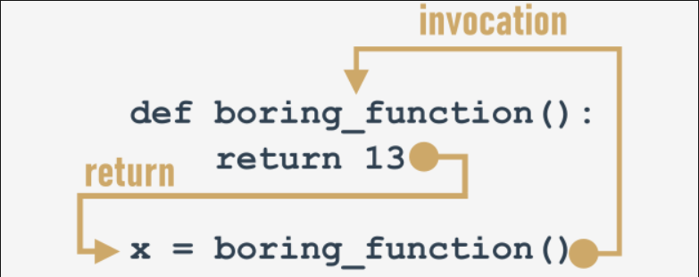

# Effects and results: the return instruction
All the previously presented functions have some kind of effect - they produce some text and send it to the console.

Of course, functions - like their mathematical siblings - may have results.

To get `functions to return a value` (but not only for this purpose) you use the `return` instruction.

This word gives you a full picture of its capabilities. Note: it's a Python `keyword`.

The `return` instruction has `two different variants` - let's consider them separately.

## return without an expression
The first consists of the keyword itself, without anything following it.

When used inside a function, it causes the `immediate termination of the function's execution, and an instant return (hence the name) to the point of invocation`.

Note: if a function is not intended to produce a result, `using the return instruction is not obligatory` - it will be executed implicitly at the end of the function.

Anyway, you can use it to `terminate a function's activities on demand`, before the control reaches the function's last line.

Let's consider the following function:
```py
def happy_new_year(wishes = True):
    print("Three...")
    print("Two...")
    print("One...")
    if not wishes:
        return
    
    print("Happy New Year!")
```

When invoked without any arguments:
```s
happy_new_year()
```

The function causes a little noise - the output will look like this:
```s
Three...
Two...
One...
Happy New Year!
```
output


Providing False as an argument:
```s
happy_new_year(False)
```

will modify the function's behavior - the `return` instruction will cause its termination just before the wishes - this is the updated output:
```s
Three...
Two...
One...
```

## return with an expression
The second `return` variant is `extended with an expression`:
```py
def function():
    return expression
```

There are two consequences of using it:

  - it causes the `immediate termination of the function's execution` (nothing new compared to the first variant)
  - moreover, the function will `evaluate the expression's value and will return (hence the name once again) it as the function's result`.

Yes, we already know - this example isn't really sophisticated:
```py
def boring_function():
    return 123

x = boring_function()

print("The boring_function has returned its result. It's:", x)
```

The snippet writes the following text to the console:
```s
The boring_function has returned its result. It's: 123
```
Let's investigate it for a while.

Analyze the figure below:


The `return` instruction, enriched with the expression (the expression is very simple here), "transports" the expression's value to the place where the function has been invoked.

The result may be freely used here, e.g., to be assigned to a variable.

It may also be completely ignored and lost without a trace.


Note, we're not being too polite here - the function returns a value, and we ignore it (we don't use it in any way):
```py
def boring_function():
    print("'Boredom Mode' ON.")
    return 123

print("This lesson is interesting!")
boring_function()
print("This lesson is boring...")
```

The program produces the following output:
```s
This lesson is interesting!
'Boredom Mode' ON.
This lesson is boring...
```
output

Is it punishable? Not at all.

The only disadvantage is that the result has been irretrievably lost.

Don't forget:

  - you are always `allowed to ignore the function's result`, and be satisfied with the function's effect (if the function has any)
  - if a function is intended to return a useful result, it must contain the second variant of the `return` instruction.

Wait a minute - does this mean that there are useless results, too? Yes - in some sense.

===============================================================================================
# A few words about None
Let us introduce you to a very curious value (to be honest, a none value) named `None`.

Its data doesn't represent any reasonable value - actually, it's not a value at all; hence, it `mustn't take part in any expressions`.

For example, a snippet like this:
```py
print(None + 2)
```

will cause a runtime error, described by the following diagnostic message:
```s
TypeError: unsupported operand type(s) for +: 'NoneType' and 'int'
```
output

Note: `None` is a `keyword`.

There are only two kinds of circumstances when None can be safely used:

  - when you assign it to a variable (or return it as a function's result)
  - when you compare it with a variable to diagnose its internal state.

Just like here:
```py
value = None
if value is None:
    print("Sorry, you don't carry any value")
```

Don't forget this: if a function doesn't return a certain value using a `return` expression clause, it is assumed that it `implicitly returns None`.

Let's test it.

===============================================================================================
# A few words about None: continued
Take a look at the code in the editor.

It's obvious that the `strangeFunction` function returns `True` when its argument is even.

What does it return otherwise?
```py
def strange_function(n):
    if(n % 2 == 0):
        return True
```
We can use the following code to check it:
```py
print(strange_function(2))
print(strange_function(1))
```

This is what we see in the console:
```s
True
None
```
output

Don't be surprised next time you see `None` as a function result - it may be the symptom of a subtle mistake inside the function.

===============================================================================================
# Effects and results: lists and functions
There are two additional questions that should be answered here.

The first is: `may a list be sent to a function as an argument?`

Of course it may! Any entity recognizable by Python can play the role of a function argument, although it has to be assured that the function is able to cope with it.

So, if you pass a list to a function, the function has to handle it like a list.

A function like this one here:
```py
def list_sum(lst):
    s = 0
    
    for elem in lst:
        s += elem
    
    return s
```

and invoked like this:
```py
print(list_sum([5, 4, 3]))
```

will return `12` as a result, but you should expect problems if you invoke it in this risky way:
```py
print(list_sum(5))
```

Python's response will be unequivocal:
```s
TypeError: 'int' object is not iterable
```
output

This is caused by the fact that a `single integer value mustn't be iterated through by the for loop`.

===============================================================================================
# Effects and results: lists and functions - continued
The second question is: `may a list be a function result?`

Yes, of course! Any entity recognizable by Python can be a function result.
```py
def strange_list_fun(n):
    strange_list = []
    
    for i in range(0, n):
        strange_list.insert(0, i)
    
    return strange_list

print(strange_list_fun(5))
```
Look at the code in the editor. The program's output will be like this:
```s
[4, 3, 2, 1, 0]
```
output

Now you can write functions with and without results.

Let's dive a little deeper into the issues connected with variables in functions. This is essential for creating effective and safe functions.

