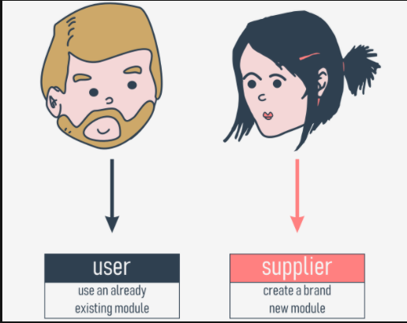
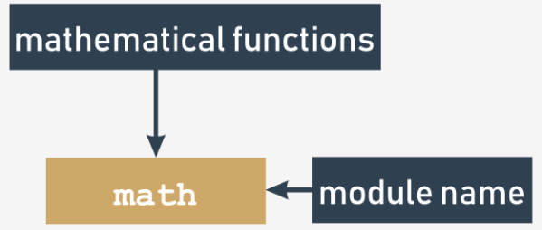

# What is a module?
Computer code has a tendency to grow. We can say that code that doesn't grow is probably completely unusable or abandoned. A real, wanted, and widely used code develops continuously, as both users' demands and users' expectations develop in their own rhythms.

A code which is not able to respond to users' needs will be forgotten quickly, and instantly replaced with a new, better, and more flexible code. Be prepared for this, and never think that any of your programs is eventually completed. The completion is a transition state and usually passes quickly, after the first bug report. Python itself is a good example how the rule acts.

Growing code is in fact a growing problem. A larger code always means tougher maintenance. Searching for bugs is always easier where the code is smaller (just as finding a mechanical breakage is simpler when the machinery is simpler and smaller).

Moreover, when the code being created is expected to be really big (you can use a total number of source lines as a useful, but not very accurate, measure of a code's size) you may want (or rather, you will be forced) to divide it into many parts, implemented in parallel by a few, a dozen, several dozen, or even several hundred individual developers.

Of course, this cannot be done using one large source file, which is edited by all programmers at the same time. This will surely lead to a spectacular disaster.

If you want such a software project to be completed successfully, you have to have the means allowing you to:

  - divide all the tasks among the developers;
  - join all the created parts into one working whole.
For example, a certain project can be divided into two main parts:

  - the user interface (the part that communicates with the user using widgets and a graphical screen)
  - the logic (the part processing data and producing results)

Each of these parts can be (most likely) divided into smaller ones, and so on. Such a process is often called `decomposition`.

For example, if you were asked to arrange a wedding, you wouldn't do everything yourself - you would find a number of professionals and split the task between them all.

How do you divide a piece of software into separate but cooperating parts? This is the question. Modules are the answer.

===================================================================================
# How to make use of a module?
So what is a module? The `Python Tutorial` defines it as `a file containing Python definitions and statements`, which can be later imported and used when necessary.

The handling of modules consists of two different issues:

   
   - the first (probably the most common) happens when you want to use an already existing module, written by someone else, or created by yourself during your work on some complex project - in this case you are the module's `user`; 
   - the second occurs when you want to create a brand new module, either for your own use, or to make other programmers' lives easier - you are the module's `supplier`.

Let's discuss them separately.

First of all, a module is identified by its `name`. If you want to use any module, you need to know the name. A (rather large) number of modules is delivered together with Python itself. You can think of them as a kind of "Python extra equipment".

All these modules, along with the built-in functions, form the `Python standard library` - a special sort of library where modules play the roles of books (we can even say that folders play the roles of shelves). If you want to take a look at the full list of all "volumes" collected in that library, you can find it here: https://docs.python.org/3/library/index.html.

Each module consists of entities (like a book consists of chapters). These entities can be functions, variables, constants, classes, and objects. If you know how to access a particular module, you can make use of any of the entities it stores.

Let's start the discussion with one of the most frequently used modules, named `math`. Its name speaks for itself - the module contains a rich collection of entities (not only functions) which enable a programmer to effectively implement calculations demanding the use of mathematical functions, like sin() or log().