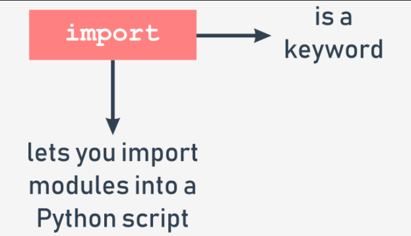

# Importing a module
To make a module usable, you must import it (think of it like of taking a book off the shelf). Importing a module is done by an instruction named `import`. Note: `import` is also a keyword (with all the consequences of this fact).



Let's assume that you want to use two entities provided by the `math` module:

  - a symbol (constant) representing a precise (as precise as possible using double floating-point arithmetic) value of π (although using a Greek letter to name a variable is fully possible in Python, the symbol is named pi - it's a more convenient solution, especially for that part of the world which neither has nor is going to use a Greek keyboard)
  - a function named `sin()` (the computer equivalent of the mathematical sine function)

Both these entities are available through the `math` module, but the way in which you can use them strongly depends on how the import has been done.

The simplest way to import a particular module is to use the import instruction as follows:
```py
import math
```

The clause contains:

  - the `import` keyword;
  - the `name of the module` which is subject to import.

The instruction may be located anywhere in your code, but it must be placed `before the first use of any of the module's entities`.


If you want to (or have to) import more than one module, you can do it by repeating the `import` clause (preferred):
```py
import math
import sys
```

or by listing the modules after the `import` keyword, like here:
```py
import math, sys
```

The instruction imports two modules, first the one named `math` and then the second named `sys`.

The modules' list may be arbitrarily long.

====================================================================
# Importing a module: continued
To continue, you need to become familiar with an important term: `namespace`. Don't worry, we won't go into great detail - this explanation is going to be as short as possible.

A `namespace` is a space (understood in a non-physical context) in which some names exist and the names don't conflict with each other (i.e., there are not two different objects of the same name). We can say that each social group is a namespace - the group tends to name each of its members in a unique way (e.g., parents won't give their children the same first names).


This uniqueness may be achieved in many ways, e.g., by using nicknames along with the first names (it will work inside a small group like a class in a school) or by assigning special identifiers to all members of the group (the US Social Security Number is a good example of such practice).

`Inside a certain namespace, each name must remain unique`. This may mean that some names may disappear when any other entity of an already known name enters the namespace. We'll show you how it works and how to control it, but first, let's return to imports.

If the module of a specified name `exists and is accessible` (a module is in fact a `Python source file`), Python imports its contents, i.e., `all the names defined in the module become known`, but they don't enter your code's namespace.

This means that you can have your own entities named `sin` or `pi` and they won't be affected by the import in any way.
```
--------------------------------------------
|                                          |
|      math                  pi            |
|                                          |
--------------------------------------------
```
At this point, you may be wondering how to access the `pi` coming from the `math` module.

To do this, you have to qualify the `pi` with the name of its original module.

====================================================================
# Importing a module: continued
Look at the snippet below, this is the way in which you qualify the names of `pi` and `sin` with the name of its originating module:
```py
math.pi
math.sin
```

It's simple, you put:

  - the `name of the module` (e.g., math)
  - a `dot` (i.e., .)
  - the `name of the entity` (e.g., `pi`)

Such a form clearly indicates the namespace in which the name exists.

Note: using this qualification is `compulsory` if a module has been imported by the `import` module instruction. It doesn't matter if any of the names from your code and from the module's namespace are in conflict or not.

This first example won't be very advanced - we just want to print the value of `sin(½π)`.

Look at the code in the editor. This is how we test it.
```py
import math
print(math.sin(math.pi/2))
```
The code outputs the expected value: `1.0`.

Note: removing any of the two qualifications will make the code erroneous. There is no other way to enter `math`'s namespace if you did the following:
```py
import math
```

====================================================================
# Importing a module: continued
Now we're going to show you how the two namespaces (yours and the module's one) can coexist.

Take a look at the example in the editor window.
```py
import math


def sin(x):
    if 2 * x == pi:
        return 0.99999999
    else:
        return None


pi = 3.14

print(sin(pi/2))
print(math.sin(math.pi/2))
```
We've defined our own `pi` and `sin` here.

Run the program. The code should produce the following output:
```s
0.99999999
1.0
```

As you can see, the entities don't affect each other.