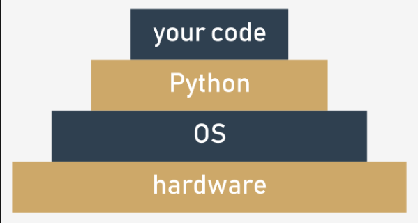

# How to know where you are?
Sometimes, it may be necessary to find out information unrelated to Python. For example, you may need to know the location of your program within the greater environment of the computer.

Imagine your program's environment as a pyramid consisting of a number of layers or platforms.



The layers are:

  - your (running) code is located at the top of it;
  - Python (more precisely - its runtime environment) lies directly below it;
  - the next layer of the pyramid is filled with the OS (operating system) - Python's environment provides some of its functionalities using the operating system's services; Python, although very powerful, isn't omnipotent - it's forced to use many helpers if it's going to process files or communicate with physical devices;
  - the bottom-most layer is hardware - the processor (or processors), network interfaces, human interface devices (mice, keyboards, etc.) and all other machinery needed to make the computer run; the OS knows how to drive it, and uses lots of tricks to conduct all parts in a consistent rhythm.

This means than some of your (or rather your program's) actions have to travel a long way to be successfully performed - imagine that:

  - `your code` wants to create a file, so it invokes one of Python's functions;
  - `Python` accepts the order, rearranges it to meet local OS requirements (it's like putting the stamp "approved" on your request) and sends it down (this may remind you of a chain of command)
  - the `OS` checks if the request is reasonable and valid (e.g., whether the file name conforms to some syntax rules) and tries to create the file; such an operation, seemingly very simple, isn't atomic - it consists of many minor steps taken by...
  - the `hardware`, which is responsible for activating storage devices (hard disk, solid state devices, etc.) to satisfy the OS's needs.

Usually, you're not aware of all that fuss - you want the file to be created and that's that.

But sometimes you want to know more - for example, the name of the OS which hosts Python, and some characteristics describing the hardware that hosts the OS.

There is a module providing some means to allow you to know where you are and what components work for you. The module is named `platform`. We'll show you some of the functions it provides to you.

======================================================
# Selected functions from the platform module
`The platform function`

The `platform` module lets you access the underlying platform's data, i.e., hardware, operating system, and interpreter version information.

There is a function that can show you all the underlying layers in one glance, named `platform`, too. It just returns a string describing the environment; thus, its output is rather addressed to humans than to automated processing (you'll see it soon).

This is how you can invoke it:
```py
platform(aliased = False, terse = False)
```

And now:

  - `aliased` → when set to `True` (or any non-zero value) it may cause the function to present the alternative underlying layer names instead of the common ones;
  - `terse` → when set to `True` (or any non-zero value) it may convince the function to present a briefer form of the result (if possible)

We ran our sample program using three different platforms - this is what we got:
```py
from platform import platform

print(platform())
print(platform(1))
print(platform(0, 1))
```
`Intel x86 + Windows ® Vista (32 bit)`:
```s
Windows-Vista-6.0.6002-SP2
Windows-Vista-6.0.6002-SP2
Windows-Vista
```

`Intel x86 + Gentoo Linux (64 bit)`:
```s
Linux-3.18.62-g6-x86_64-Intel-R-_Core-TM-_i3-2330M_CPU_@_2.20GHz-with-gentoo-2.3
Linux-3.18.62-g6-x86_64-Intel-R-_Core-TM-_i3-2330M_CPU_@_2.20GHz-with-gentoo-2.3
Linux-3.18.62-g6-x86_64-Intel-R-_Core-TM-_i3-2330M_CPU_@_2.20GHz-with-glibc2.3.4
```

`Raspberry PI2 + Raspbian Linux (32 bit)`:
```s
Linux-4.4.0-1-rpi2-armv7l-with-debian-9.0
Linux-4.4.0-1-rpi2-armv7l-with-debian-9.0
Linux-4.4.0-1-rpi2-armv7l-with-glibc2.9
```

You can also run the sample program in IDLE on your local machine to check what output you will have.

======================================================
# Selected functions from the platform module: continued
`The machine function`

Sometimes, you may just want to know the generic name of the processor which runs your OS together with Python and your code - a function named `machine()` will tell you that. As previously, the function returns a string.

Again, we ran the sample program on three different platforms:
```py
from platform import machine

print(machine())
```
`Intel x86 + Windows ® Vista (32 bit)`:
```s
x86
```

`Intel x86 + Gentoo Linux (64 bit)`:
```s
x86_64
```

`Raspberry PI2 + Raspbian Linux (32 bit)`:
```s
armv7l
```

======================================================
# Selected functions from the platform module: continued
`The processor function`

The `processor()` function returns a string filled with the real processor name (if possible).

Once again, we ran the sample program on three different platforms:
```py
from platform import processor

print(processor())
```

`Intel x86 + Windows ® Vista (32 bit)`:
```s
x86
```

`Intel x86 + Gentoo Linux (64 bit)`:
```s
Intel(R) Core(TM) i3-2330M CPU @ 2.20GHz
```

`Raspberry PI2 + Raspbian Linux (32 bit)`:
```s
armv7l
```

Test this on your local machine.

======================================================
# Selected functions from the platform module: continued
`The system function`

A function named `system()` returns the generic OS name as a string.

Our example platforms presented themselves like this:
```py
from platform import system

print(system())
```

`Intel x86 + Windows ® Vista (32 bit)`:
```s
Windows
```

`Intel x86 + Gentoo Linux (64 bit)`:
```s
Linux
```

`Raspberry PI2 + Raspbian Linux (32 bit)`:
```s
Linux
```