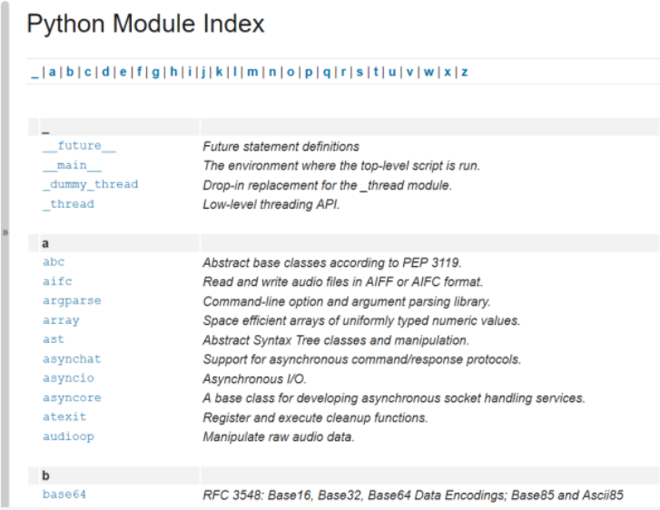

# Selected functions from the platform module: continued
`The version function`

The OS version is provided as a string by the `version()` function.

Run the code and check its output. This is what we got:
```py
from platform import version

print(version())
```

`Intel x86 + Windows ® Vista (32 bit)`:
```s
6.0.6002
```

`Intel x86 + Gentoo Linux (64 bit)`:
```s
#1 SMP PREEMPT Fri Jul 21 22:44:37 CEST 2017
```

`Raspberry PI2 + Raspbian Linux (32 bit)`:
```s
#1 SMP Debian 4.4.6-1+rpi14 (2016-05-05)
```

==========================================================
# Selected functions from the platform module: continued
`The python_implementation and the python_version_tuple functions`

If you need to know what version of Python is running your code, you can check it using a number of dedicated functions - here are two of them:
```py
from platform import python_implementation, python_version_tuple

print(python_implementation())

for atr in python_version_tuple():
    print(atr)
```
  - `python_implementation()` → returns a string denoting the Python implementation (expect `CPython` here, unless you decide to use any non-canonical Python branch)

  - `python_version_tuple()` → returns a three-element tuple filled with:
    - the major part of Python's version;
    - the minor part;
    - the patch level number.

Our example program produced the following output:
```s
CPython
3
7
7
```

It's very likely that your version of Python will be different.

==========================================================
# Python Module Index
We have only covered the basics of Python modules here. Python's modules make up their own universe, in which Python itself is only a galaxy, and we would venture to say that exploring the depths of these modules can take significantly more time than getting acquainted with "pure" Python.

Moreover, the Python community all over the world creates and maintains hundreds of additional modules used in very niche applications like genetics, psychology, or even astrology.

These modules aren't (and won't be) distributed along with Python, or through official channels, which makes the Python universe broader - almost infinite.

You can read about all standard Python modules here: https://docs.python.org/3/py-modindex.html.

Don't worry - you won't need all these modules. Many of them are very specific.

All you need to do is find the modules you want, and teach yourself how to use them. It's easy.



In the next section we'll take a look at something else. We're going to show you how to write your own module.
