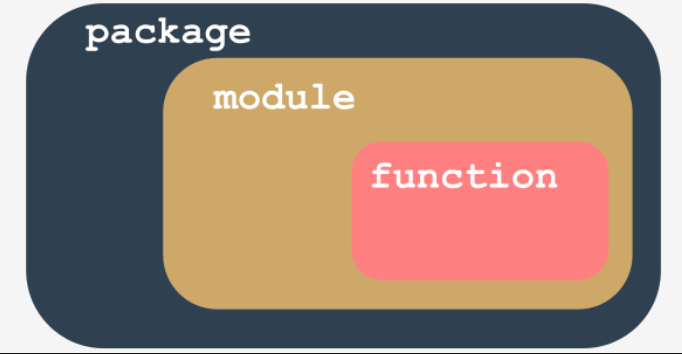

# What is a package?
Writing your own modules doesn't differ much from writing ordinary scripts.

There are some specific aspects you must be aware of, but it definitely isn't rocket science. You'll see this soon enough.

Let's summarize some important issues:

  - a `module is a kind of container filled with functions` - you can pack as many functions as you want into one module and distribute it across the world;
  - of course, it's generally a good idea not to mix functions with different application areas within one module (just like in a library - nobody expects scientific works to be put among comic books), so group your functions carefully and name the module containing them in a clear and intuitive way (e.g., don't give the name `arcade_games` to a module containing functions intended to partition and format hard disks)
  - making many modules may cause a little mess - sooner or later you'll want to `group your modules` exactly in the same way as you've previously grouped functions - is there a more general container than a module?
  - yes, there is - it's a `package`; in the world of modules, a package plays a similar role to a folder/directory in the world of files.

======================================================================
