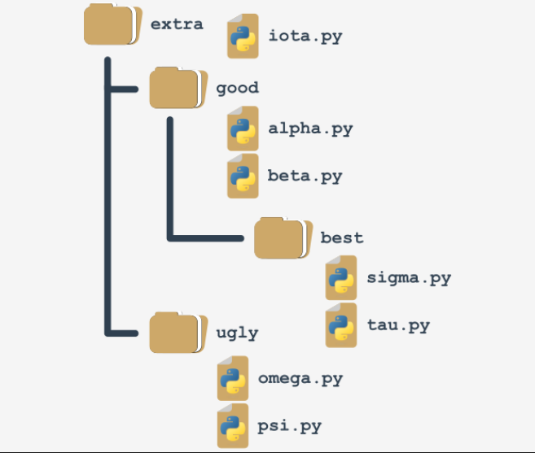
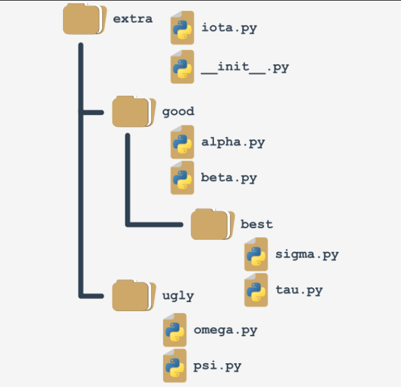
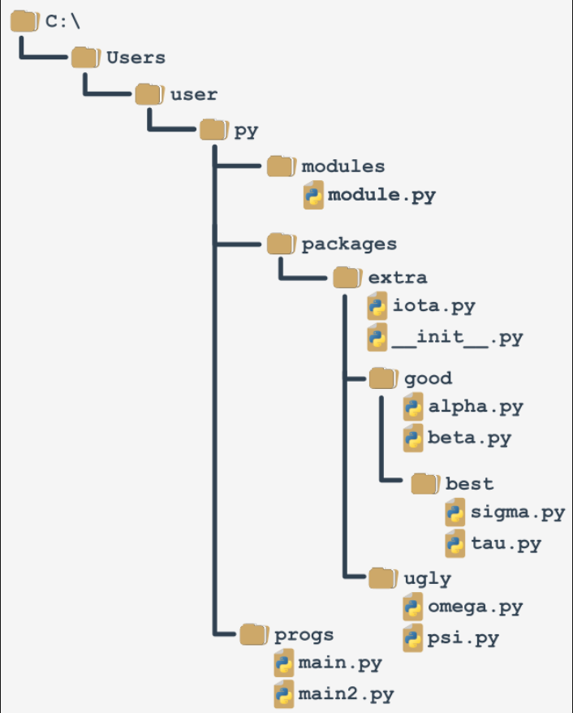

## Your first package: step 1
Imagine that in the not-so-distant future you and your associates write a large number of Python functions.

Your team decides to group the functions in separate modules, and this is the final result of the ordering:
```py
**************************************
|--> package
      |
      |--> alpha.py
          #! /usr/bin/env/ python3
          """module: alpha"""
          def funA():
              return "Alpha"
          if __name__ == "__main__":
              print("I prefer to be a module")

      |--> beta.py
           def funB(): ...

      |--> iota.py
           def funI(): ...

      |--> sigma.py
           def funS(): ...

      |--> tau.py
           def funT(): ...

      |--> psi.py
           def funP(): ...

      |--> omega.py
           def funO(): ...

**************************************
```
Note: we've presented the whole content for the alpha.py module only - assume that all the modules look similar (they contain one function named `funX`, where X is the first letter of the module's name).

## Your first package: step 2
Suddenly, somebody notices that these modules form their own hierarchy, so putting them all in a flat structure won't be a good idea.

After some discussion, the team comes to the conclusion that the modules have to be grouped. All participants agree that the following tree structure perfectly reflects the mutual relationships between the modules:
```s
**************************************
|--> group: extra
      |
      |--> module: iota.py
      |            def funI():
      |
      |--> group: good
      |            |--> module: alpha.py
      |            |            def funA(): ...
      |            |
      |            |--> module: beta.py
      |            |            def funB(): ...
      |            |
      |            |--> group: best
      |            |             |--> module: sigma.py
      |            |                          def funS(): ...
      |            |
      |            |--> module: tau.py
      |                         def funT(): ...
      |
      |--> group: ugly
      |            |--> module: psi.py
                                def funP():...
**************************************
```
Let's review this from the bottom up:

  - the ugly group contains two modules: psi and omega;
  - the best group contains two modules: sigma and tau;
  - the good group contains two modules (alpha and beta) and one subgroup (best)
  - the extra group contains two subgroups (good and bad) and one module (iota)

Does it look bad? Not at all - analyze the structure carefully. It resembles something, doesn't it?

It looks like a `directory structure`.

Let's build a tree reflecting projected dependencies between the modules.

## Your first package: step 3
This is how the tree currently looks:



Such a structure is almost a package (in the Python sense). It lacks the fine detail to be both functional and operative. We'll complete it in a moment.

If you assume that extra is the name of a `newly created package` (think of it as the `package's root`), it will impose a naming rule which allows you to clearly name every entity from the tree.

For example:

  - the location of a function named `funT()` from the tau package may be described as:
    ```s
    extra.good.best.tau.funT()
    ```

  - a function marked as:
    ```s
    extra.ugly.psi.funP()
    ```
    comes from the psi module being stored in the ugly subpackage of the extra package.

## Your first package: step 4
There are two questions to answer:

  - `how` do you transform such a tree (actually, a subtree) into a real Python `package` (in other words, how do you convince Python that such a tree is not just a bunch of junk files, but a set of modules)?
  - `where` do you put the subtree to make it accessible to Python?

The first question has a surprising answer: `packages, like modules, may require initialization`.

The initialization of a module is done by an unbound code (not a part of any function) located inside the module's file. As a package is not a file, this technique is useless for initializing packages.

You need to use a different trick instead - Python expects that there is a file with a very unique name inside the package's folder: `__init__.py`.

The content of the file is executed when any of the package's modules is `imported`. If you don't want any special initializations, you can leave the file empty, but you mustn't omit it.

## Your first package: step 5
Remember: `the presence of the __init.py__ file finally makes up the package`.



Note: it's not only the root folder that can contain `__init.py__` file - you can put it inside any of its subfolders (subpackages) too. It may be useful if some of the subpackages require individual treatment and special kinds of initialization.

Now it's time to answer the second question - the answer is simple: `anywhere`. You only have to ensure that Python is aware of the package's location. You already know how to do that.

You're ready to make use of your first package.

## Your first package: step 6
Let's assume that the working environment looks as follows:



We've prepared a zip file containing all the files from the packages branch. You can download it and use it for your own experiments, but `remember to unpack it in the folder presented in the scheme`, otherwise, it won't be accessible to the code from the main file.

DOWNLOAD   Modules and Packages ZIP file

You'll be continuing your experiments using the main2.py file.

## Your first package: step 7
We are going to access the `funI()` function from the iota module from the top of the extra package. It forces us to use qualified package names (associate this with naming folders and subfolders - the conventions are very similar).

This is how to do it:

The main2.py file
```py
#main2.py

from sys import path
path.append('..\\packages')

import extra.iota
print(extra.iota.funI())
```

Note:

  - we've modified the `path` variable to make it accessible to Python;
  - the `import` doesn't point directly to the module, but specifies the fully qualified path from the top of the package;

replacing `import extra.iota` with `import iota` will cause an error.

The following variant is valid too:

The main2.py file alternative version
```py
#main2.py
from sys import path
path.append('..\\packages')

from extra.iota import funI
print(funI())
```
Note the qualified name of the iota module.

## Your first package: step 8
Now let's reach all the way to the bottom of the tree - this is how to get access to the sigma and tau modules:

The main2.py file
```py
#main2.py

from sys import path

path.append('..\\packages')

import extra.good.best.sigma
from extra.good.best.tau import funT

print(extra.good.best.sigma.funS())
print(funT())
```

You can make your life easier by using aliasing:

The main2.py file
```py
#main2.py

from sys import path

path.append('..\\packages')

import extra.good.best.sigma as sig
import extra.good.alpha as alp

print(sig.funS())
print(alp.funA())
```

## Your first package: step 9
Let's assume that we've zipped the whole subdirectory, starting from the extra folder (including it), and let's get a file named extrapack.zip. Next, we put the file inside the packages folder.

Now we are able to use the zip file in a role of packages:
```py
#main2.py
from sys import path

path.append('..\\packages\\extrapack.zip')

import extra.good.best.sigma as sig
import extra.good.alpha as alp
from extra.iota import funI
from extra.good.beta import funB

print(sig.funS())
print(alp.funA())
print(funI())
print(funB())
```

If you want to conduct your own experiments with the package we've created, you can download it below. We encourage you to do so.

`DOWNLOAD`   Extrapack ZIP file

Now you can create modules and combine them into packages. It's time to start a completely different discussion - about errors, failures and crashes.
